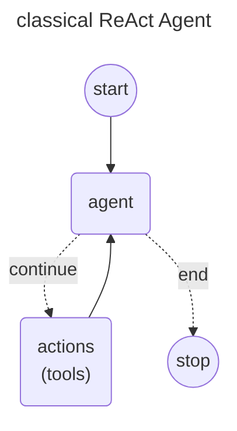
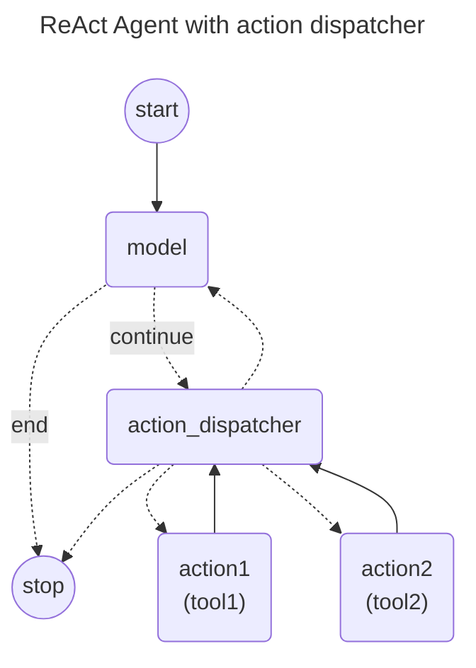
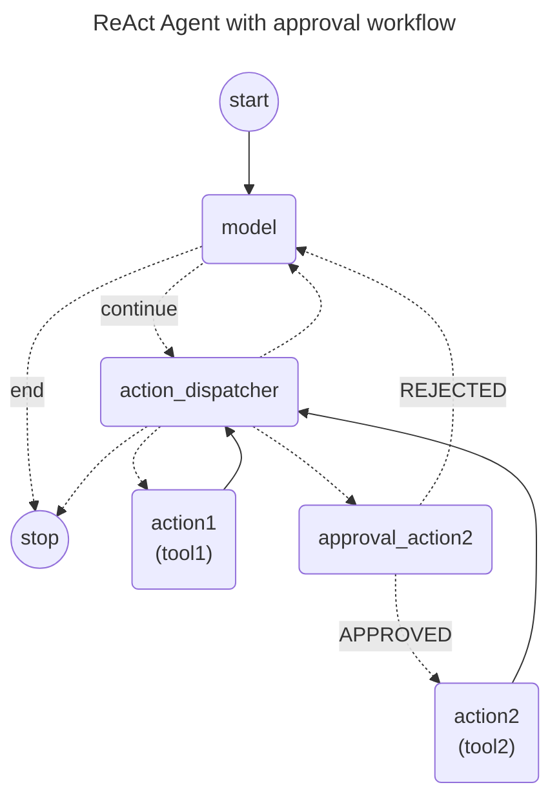

I would write an article about "how to implements Human-in-the-loop using langgraph4j library", in particular i would like focus on how to evolve the classical Agent executor (aka ReACT Agent) implementation (refers to @langchain4j/langchain4j-agent/src/main/java/org/bsc/langgraph4j/agentexecutor/AgentExecutor.java) to support human approval before an action (refers to @langchain4j/langchain4j-agent/src/main/java/org/bsc/langgraph4j/agentexecutor/AgentExecutorEx.java). 

Key takeways

- How to evolve classical Agent Executor implementation (refer to Diagram1) to support human approval flow
    1. move from standard agent loop to extended agent loop supporting action dispatcher and a node for each action (refers to Diagram2)
    2. wrap action with an approval node (refers to Diagram3)
- An implementation example using langgraph4j and langchain4j (refers to @langchain4j/langchain4j-agent/src/test/java/org/bsc/langgraph4j/agentexecutor/app/DemoConsoleController.java). I need details on "A Practical Example" with adding of code snippets focusing on usage of @langgraph4j-core/src/main/java/org/bsc/langgraph4j/action/InterruptionMetadata.java usage that is explained in @src/site/mkdocs/core/low_level.md in the breakpoints section

## diagram1

## Diagram2

## Diagram3
