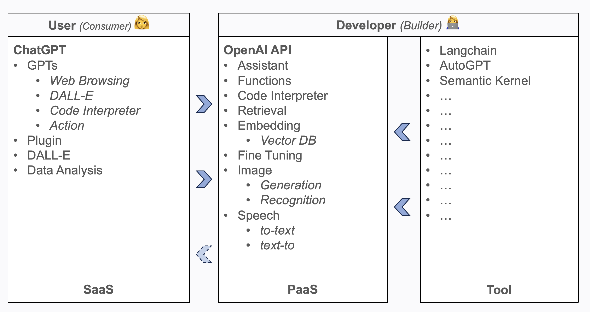

### The raise of AI, LLM and Cognitive Architecture

The raise of AI and in particular of the Large Language Model (LLM), has started a race to create  game changer applications that use Al to deliver new and disruptive services.

For this reason new application architecture involving LLM has been developed focusing on:

- how is context provided to the application
- how does the application “reason” over it

Both of these components could be defined the <u>**cognitive architecture**</u> of an application that is fantastic term to describe this new kind of smart applications.

But before delving into the details of cognitive architecture, let's clarify some concepts to better understand our role in this emerging field.

### Are we AI User or AI Developer ?

First we have to determine whether you are an AI user or an AI developer. An AI user interacts with AI assistants (ie Chat) while an AI developer works with AI backend services (ie API). The diagram below illustrates the different aspects of the AI landscape, specifically focusing on the [OpenAI] ecosystem (although this can be generalised to other AI providers). By understanding your goals with AI, you can identify the specific role you need to take on.

Obviously the greater part of usage of AI, currently, is as consumers using [ChatGPT], [Bard] (aka Gemini), [Copilot], etc… In terms of cloud tiers, this falls under the [Software as a Service (SaaS)][saas] category. However, as developers, we should also consider the [Platform as a Service (PaaS)][paas] category and choose the appropriate frameworks and tools for building solutions.

So the question is: "Are we ready to embrace AI development and add new smart services to our applications through AI models?".
If answer is yes, we have to start learning the new emerging cognitive architecture and its patterns to be ready for the new development challenges that AI and in particular the large language models are putting in front of us.

### PaaS vs MaaS

Now we have understood that as AI developer we have to consider accessing to AI models using [PaaS] but We must keep in mind that a new ad-hoc tier is coming to play that is **Model as a Service (MaaS)**. **MaaS** is an emerging standard of cloud services that allows access to a variety of pre-built, pre-trained machine learning models in a standardised manner. These models cover a wide range of AI tasks simplifing the process of integrating AI capabilities into applications.

### Conclusion 

Well, In the next article, we will explore bit more the cognitive architecture, including the most commonly used patterns and when and how to apply them to popular use cases. In the meanwhile ... happy "cognitive" coding 

[saas]: https://en.wikipedia.org/wiki/Software_as_a_service
[paas]: https://en.wikipedia.org/wiki/Platform_as_a_service
[ChatGPT]: https://chat.openai.com/
[Bard]: https://bard.google.com/chat
[Copilot]: https://copilot.microsoft.com/
[OpenAI]: https://openai.com/
[article1]: https://blog.langchain.dev/openais-bet-on-a-cognitive-architecture/