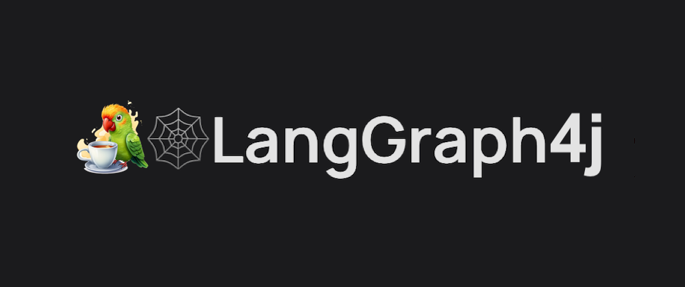
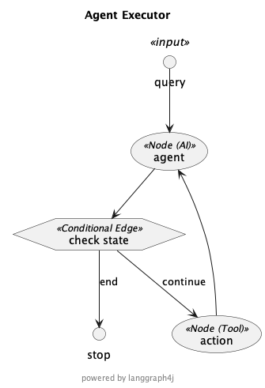
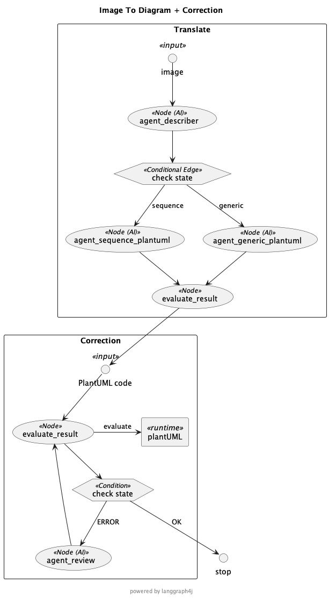

 

##  LangChain and LangGraph

In the previous article [AI Agent on iOS with LangGraph for Swift]() I've introduced [Langgraph-swift] an implemetation of [LangGraph] a library, powered by [LangChain] for building stateful, multi-actor applications with LLMs that lets you coordinate and checkpoint multiple chains (or actors) across cyclic computational steps using regular `python` or `Javascript` functions. 

As said, I developed [Langgraph-swift] to reuse my knowledege around [LangGraph] and [LangChain] for building 
[Langchain] iOS apps powered by LLM.

## Why LangGraph for Java ❓

Since I've dealt with companies which IT department is mainly based on Java technology and they would want explore and experiment LLM in their application, I've choose to use [LangChain4j] framework and, as consecuence,  I've decided to develop [LangGraph4j] to reuse, again, my knowledege around [LangGraph] and [LangChain].

## Use LangGraph4j with LangChain4j 

[LangGraph4j] can work seamlessly with [LangChain4j] and to proof that I've implemented a couple of use cases described below 

### Agent Executor

The agent executor is the runtime for an agent. This is what actually calls the agent, executes the actions it chooses, passes the action outputs back to the agent, and repeats. Below the diagram representing the implemented graph, for the complete code [take look here 👀]

### Image To Diagram

I've also experimented LLM multi-modality capabilities developing a graph where, initially, an agent receives an image and is responsible for analyzing and describing its content, such description is then passed to a specialized agent equipped with the skills to translate the description into PlantUML code. 

Take note that to ensure precision in diagram generation, the type of diagram identified within the image dictates the selection of the appropriately skilled agent for the translation task.

Finally, in the case that there are errors in result of PlantUML code we have established a supplementary flow that provided a correction process consisting of iteration between both verification and rewrite steps. 
Below the diagram representing the implemented graph, for the complete code [take look here 👀]

## Conclusion 

Currently, I haven't relased a stable version yet only the developer one `1.0-SNAPSHOT`.

In conclusion, [LangGraph4j][langgraph.swift] is an exciting new project that brings the power and flexibility of the original [LangGraph] project to iOS platform. By working jointly with [LangChain for Swift][Langchain-swift], developers can easily create cyclical graphs and build advanced AI systems. We encourage [Swift] developers to explore this new project and contribute to its growth and development. In the meanwhile, enjoy coding! 👋 

[AgentExecutor.new]: https://github.com/bsorrentino/LangGraph-Swift/blob/main/LangChainDemo/LangChainDemo/AgentExecutor.swift
[AgentExecutor]: https://github.com/buhe/langchain-swift/blob/main/Sources/LangChain/agents/Agent.swift
[langgraph.swift]: https://github.com/bsorrentino/LangGraph-Swift
[Swift]: https://www.swift.org
[LangGraph]: https://python.langchain.com/docs/langgraph 
[langgraph.blog]: https://blog.langchain.dev/langgraph/
[langchain]: https://python.langchain.com/docs/get_started/introduction
[langchain.js]: https://js.langchain.com/docs/get_started/introduction
[Langchain4j]: https://github.com/langchain4j
[Langchain-swift]: https://github.com/buhe/langchain-swift