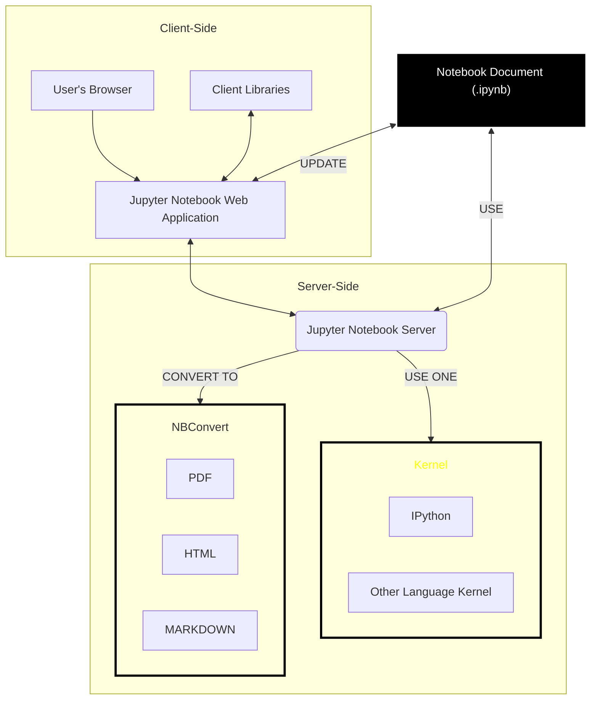

<br>

## The powerful of Jupyter Notebook

[Jupyter] Notebooks are an excellent tool, originally developed to help data scientists and engineers to simplify their work with data using python programming language; in fact, the interactive nature of notebooks makes them ideal for quickly see the code results without setting up a development environment, compiling, packaging and so on. This particular feature has been crucial for adoption  in data science, machine learning, and statistical modeling where development skill was less essential than data manipulation expertise.

### Advantages

Below are some of the advantages of [Jupyter] notebook  

1. **Interactive Development**: Notebooks allow developers to write code in small chunks, test them immediately, and visualize results. This interactive workflow promotes faster iteration and debugging, ideal for data exploration, algorithm development, and quick prototyping.
2. **Rich Visualizations**: Typically Notebook are integrated with powerful visualization libraries that are able to display plots, graphs, and other visual outputs inline.
3. **Documentation and Code Together**: Notebooks combine executable code with markdown cells, allowing developers to document their code, explain logic, etc.., creating more readable and maintainable codebases.
4. **Collaboration**: By sharing notebooks, team members can review and run code without setting up a development environment, making collaboration easier, especially in cross-functional teams involving non-technical stakeholders.
5. **Reproducibility**: Notebooks can be rerun from top to bottom, ensuring that any analysis or test can be consistently reproduced. This is crucial for debugging, testing, or presenting results.

**Summarizing we can say that** 
> Jupyter notebooks streamline the development process, from initial exploration to production-ready code, offering flexibility and real-time feedback.

## Break the Python barrier

Considering the advantages that offer [Jupyter] notebooks, would be great for software developer use such notebook approach to develop, for example, **USE CASE TESTS** for projects  or providing useful **INTERACTIVE HOW-TO**.

**The question here is**: 
> IS IT POSSIBLE USE JUPYTER NOTEBOOK FOR PROGRAMMING LANGUAGE OTHER THAN PYTHON ?

The answer is **YES**🤩.

### The Jupiter Architecture

The [Jupyter] tools has been architected to support multiple programming languages though the **Kernel** concept, see diagram below:


The kernel is how the [Jupyter] notebook server evaluates blocks of code written by the user inside the notebook document (.ipynb), so it is sufficient to have a kernel that can evaluate the code of the programming language of your choice to have it supported by [Jupyter] notebook. Of course, it is easy to deduce that every potential programming language that a [Jupyter] Kernel can support should be evaluable in the Read–eval–print loop ([REPL]) way.

So the question becomes: ARE THERE JUPYTER KERNEL OTHER THAN PYTHON ONE ?

The answer is **Yes**🤩. 

Lately I've been working on [Langgraph4J] which is a Java implementation of the more famous [Langgraph.js] which is a Javascript library used to create agent and multi-agent workflows by [Langchain]. Interesting note is that [Langchain.js] uses Javascript [Jupyter] notebooks powered by a [DENO Jupiter Kernel][deno.jupyter] to implement and document [How-Tos]. So I faced with a dilemma on how to use (or possibly simulate) the same approach in Java. So without much hope I started looking for a [Jupyter] Kernel that supported Java considering that from the JDK 9 version there was the introduction of [JShell] that enabled the REPL for Java.

### The Java Jupyter Kernel
After a bit of researches (and also a weird thought of trying to throw myself into a DIY implementation) I landed on [rapaio-jupyter-kernel][java.jupyter] which is a Jupyter Kernel that supports Java 🤩. The project states:

> Jupyter kernel for Java language based on [JShell]. It implements Jupyter message specification version `5.4`, and it requires Java = `22`.

It is really amazing,I'm starting to use it and WOW!🤯. Take a look of some of its [features][examples] presented as a notebook itself:

### Java Jupyter notebook example
---

> You can write normal Java.
> ```java
> var result = 2 + 2;
> result
> ```
> `4`
> ```java
> // including classes
> record Complex(double a, double b) {
>     public Complex add(Complex c) {
>         return new Complex(a+c.a, b+c.b);
>     }
> }
> Complex x = new Complex(10,20);
> x.add(new Complex(1,1))
> ```
> `Complex[a=11.0, b=21.0]`
> ```java
> // methods can also be implemented
> int add(int a, int b) { return a+b; }
> add(2,3)
> ```
> `5`
> ### Magic commands
> Besides Java code, a cell can contain special commands implemented by the kernel. These are called magic code and there are two types: magic lines and magic cells. 
> **Magic lines** are lines which are prefixed with `%`. After the prefix it is followed by the magic command and the optional parameters. Below is an example of magic line:
> ```java
> // magic line which asks JShell to list the types defined in this notebook in this moment
> %jshell /types
> ```
> `|    record Complex`
> ### Magic commands interpolation
> Sometimes there is a need to run a magic command in a more dynamic way. This can be done using magic interpolation.
> Magic interpolation is the interpolation of marked content which starts with `\{` and ends with `}`. Any content decorated with those markers is evaluated in jshell and the result is transformed in a String which replaces the decorated content in the magic command.
> ```java
> String version = "1.0.2";
> ```
> ```java
> %dependency /add com.github.javafaker:javafaker:\{version}
> ```
> `Adding dependency com.github.javafaker:javafaker:1.0.2`
> ### Dependency management 🤩
> You can add dependencies using `%dependency /add` and after adding all dependencies you can call `%dependency /resolve`
> ```java
> %dependency /add com.github.javafaker:javafaker:1.0.2
> %dependency /resolve
> ```
>
> ```
> Adding dependency com.github.javafaker:javafaker:1.0.2
> Solving dependencies
> Resolved artifacts count: 5
> Add to classpath: /home/ati/work/rapaio-jupyter-kernel/target/mima_cache/com/github/javafaker/javafaker/1.0.2/javafaker-1.0.2.jar
> Add to classpath: /home/ati/work/rapaio-jupyter-kernel/target/mima_cache/org/apache/commons/commons-lang3/3.5/commons-lang3-3.5.jar
> Add to classpath: /home/ati/work/rapaio-jupyter-kernel/target/mima_cache/org/yaml/snakeyaml/1.23/snakeyaml-1.23-android.jar
> Add to classpath: /home/ati/work/rapaio-jupyter-kernel/target/mima_cache/com/github/mifmif/generex/1.0.2/generex-1.0.2.jar
> Add to classpath: /home/ati/work/rapaio-jupyter-kernel/target/mima_cache/dk/brics/automaton/automaton/1.11-8/automaton-1.11-8.jar
> ```
> When added you can import and use the dependency.
> ```java
> import com.github.javafaker.Faker;
> var faker = new Faker();
> faker.name().fullName()
> ```
> Hayley Anderson
> ### Resolving conflict dependencies
> You there are conflicts you can manage them with optional. Let's take an example which have conflicts:
> ```java
> %dependency /add com.google.guava:guava:20.0 --optional
> %dependency /add com.google.inject:guice:4.2.2
> %dependency /add com.google.guava:guava:25.1-android
> %dependency /resolve
> ```
> ### Help on magic commands
> The magic `%help` provides more examples and guidance. 
> ### JShell commands
> Some JShell commands are implemented. For example you can inspect which variables are defined
> ```java
> %jshell /vars
> ```
> or the types you defined in this session
> ```java
> %jshell /types
> ```
> ### Execute bash commands
> You can execute bash scripting commands. Here we display the java version number.
> ```bash
> %%bash
> java --version
> ```
> ```
> openjdk 22.0.2 2024-07-16
> OpenJDK Runtime Environment Corretto-22.0.2.9.1 (build 22.0.2+9-FR)
> OpenJDK 64-Bit Server VM Corretto-22.0.2.9.1 (build 22.0.2+9-FR, mixed mode, sharing)
> ```

>
> You can even define variables. In fact all the lines below cell magic marker are executed as a bash script.
> ```bash
> %%bash
> name="John"
> echo "Hello $name"
> ```
>
> `Hello John`
>
>
> ### Show an image for immediate inspection
> ```java
> %image https://www.google.com/logos/doodles/2024/paris-games-sailing-6753651837110529.4-law.gif
> ```
>     
> 
>     
> ### Display data
> Jupyter notebooks uses outputs to display objects of various types. By default when an object is returned as the result of the last code operation, that result is displayed. 
> The object which is displayed can be anything. If the object has a display handler registered, than that renderer is used to transform the object into a displayable content. If there is no registered display handler than the object is transformed into a string and that will be displayed.
> Previously we used magic commands to display an image. However for BufferedImages there is a registered handler and if you obtain an instance of a BufferedImage it will be displayed properly.
> ```java
> import javax.imageio.*;
> display(ImageIO.read(new URL("https://www.google.com/logos/doodles/2024/paris-games-sailing-6753651837110529.4-law.gif")));
> ```
> Displayed data has a mime type. You can use that to describe how the object should be interpreted. For example we display a markdown snippet and we direct the output interpretation of the snippet through MIME type.
> ```java
> display("text/markdown", "Markdown *test* **snippet**:\n* bullet 1\n* bullet 2")
> ```
>
> Markdown *test* **snippet**:
> * bullet 1
> * bullet 2
>
>
> `display` command returns an id which identifies the piece of output from the notebook which handles the display. Notice that we captured the id of the display. This id can be used to update the same display with a different content. For example we can update the content of that display with a html snippet, using the MIME type for interpretation.
> ```java
> String id = display("text/markdown", "Markdown *test* **snippet**:\n* bullet 1\n* bullet 2");
> ```
>> ```java
>> updateDisplay(id, "text/html", "Html <i>test</i> <b>snippet</b>:<p><ulist><li>bullet 1</li><li>bullet 2</li></ulist></p>")
> ```
> A Java object is displayed as a String using *`Objects.toString`*. As such, if the object has an implementation of *`toString`*, that method will be called.
> ```java
> new Complex(10,Math.PI);
> ```
>
> `Complex[a=10.0, b=3.141592653589793]`
>
>
---

## Conclusions


[Jupyter]: https://jupyter.org
[REPL]: https://en.wikipedia.org/wiki/Read–eval–print_loop
[deno.jupyter]: https://deno.com/blog/v1.37
[java.jupyter]: https://github.com/padreati/rapaio-jupyter-kernel
[Langgraph.js]: https://langchain-ai.github.io/langgraphjs/
[Langchain]: https://github.com/hwchase17/langchain
[How-Tos]: https://github.com/langchain-ai/langgraphjs/tree/main/examples/how-tos
[examples]: https://github.com/padreati/rapaio-jupyter-kernel/blob/main/example.ipynb
[JShell]: https://en.wikipedia.org/wiki/JShell
[Langgraph4J]: https://github.com/bsorrentino/langgraph4j