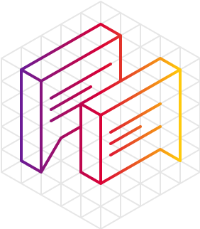
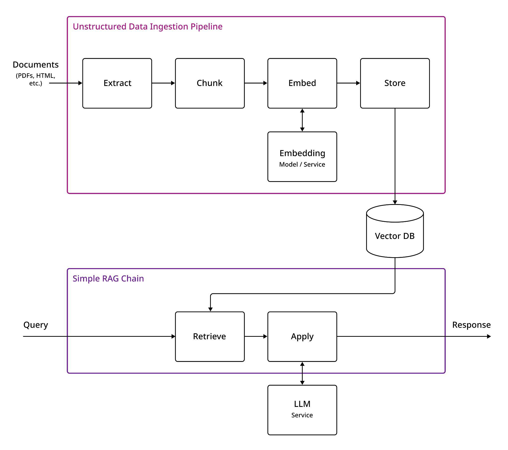
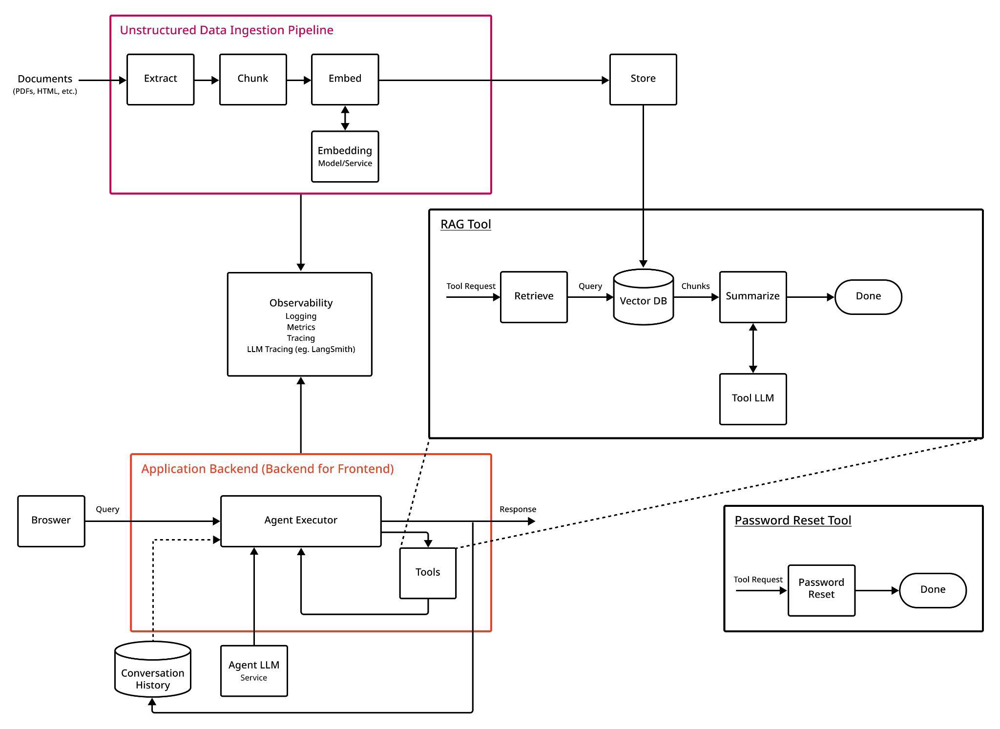

##### GUIDE
An LLM Agent
Reference
Architecture

Demystifying LLM-based systems
Design patterns, architectural examples, and tools

to help navigate the complex world of
large-language models—and get generative AI
applications to production

---

Large language models are the foundational building blocks of generative AI. The excitement
surrounding LLMs has risen to a fever pitch, but it’s also created a fair share of confusion, with
countless voices promoting LLMs, often accompanied by a cloud of hype.
Working with numerous customers that have implemented LLMs in production environments,
DataStax and LangChain have a wealth of experience and an understanding of exactly what it takes
to build a clear and practical roadmap for harnessing the power of LLMs.
Through this collaboration, we’ll provide a comprehensive reference architecture, offering insights
on how to approach complex problems, break them down into manageable components, and
ultimately help you unlock the potential of LLMs.
Design patterns
Your use case dictates the complexity of the design pattern you employ. There are three common
design patterns, each with different architectural considerations, including how you structure the
interactions with the LLM and how you deploy alongside the rest of your system. Here we’ll
summarize them, then provide three specific architectural examples, and then dive more deeply
into the components.
● Pattern 1: Single LLM call Typical use cases include using an LLM for a specific function like
summarizing or extracting information. In this case, the LLM is called from code instead of
via an end-user in a chat-like interface (see example 1 below). Here many details of building
the LLM application are simplified.
● Pattern 2: LLM + Retriever Typical use cases include building a chatbot or user support
agent. If you’re building either of these agents, you’ll have to decide how complex the
interactions need to be. If you’re building a widget that helps answer questions about your
documentation, a simple chain with retrieval-augmented generation (RAG) is likely
sufficient. See example 2.
● Pattern 3: LLM + tools + memory + retriever Use cases include more advanced chatbots
or agents. If you anticipate user questions triggering the need to retrieve information on
multiple topics in one or more hops and/or being able to invoke APIs or take actions on
behalf of the user, you should likely start with an agent chain. See example 3.

---

### Architecture examples
Each LLM application example below shows a practical, high-level architecture diagram and some
LangChain Expression Language (LCEL) code to highlight the conceptual modular architectures that
are possible.
For simpler applications – especially those where the user isn’t interacting directly with the LLM –
some of the components might be unnecessary. For example, when using an LLM to perform
summarization or sentiment analysis, you might not need to store unstructured data in a vector
database to perform RAG, nor would you need the data pipeline that populates it.
On the other hand, every LLM application might require additional components and considerations
based upon the application. For instance, if you’re building sentiment analysis of messages in a
stream, you’ll need the stream and stream-processing components; a browser-based chat bot,
however, needs a “backend-for-the-frontend” service providing the necessary interactions.
Example 1: Sentiment analysis on a stream
When building an LLM stream processor or service, many details of building LLM applications are
simplified. Because you control the input to the LLM, you generally build a prompt that expresses
the task you want to complete, and fill in the blanks with the information from the message or
request being processed. Many of the LLM-specific topics discussed in the next section are still
relevant to your architecture. They’ll be combined with the stream-processing or request-serving
details needed for your use case.
Below we’re applying an LLM to extract the general sentiment of messages in an event stream
involving the standard architecture and best practices for creating any stream processor. Here we
show an example using a Kafka Consumer to process events from a stream; the key differences are:
1. At some point, the function being applied by the stream processor invokes an LLM using a
chain described with LangChain.
2. The LLM is running in a separate service. This could be a managed service running
proprietary models like OpenAI, or managed or self-hosted versions of open models, like
Llama2.
3. LangChain uses an LLM service (outside of the stream processor).

---

The major component here is the stream processor:
The stream processor
As events occur on the stream, they may go through several steps within each worker node:
1. Preprocessing Before the LLM is invoked, the stream processing logic might inspect the
message to determine if it even needs to use an LLM. If it is necessary, then the information
in the message is used to produce the prompt for the LLM.
2. LLM application Once the information for the message has been turned into the prompt
needed for the LLM call, the LLM can be invoked. This tends to be string-in and string-out.
3. Post-processing After the LLM has produced the output string, the stream processor will
take additional actions based on the result. This might include assembling and publishing
an output message, or performing some side-effects such as recording the result in a
database or calling an API to indicate messages with a certain sentiment have been
received.
As with all of the LLM system architectures, the LLM application uses LangChain to describe the
sequence of steps necessary to invoke the LLM. LangChain uses an LLM service – either OpenAI or a
self-hosted microservice executing the LLM. We recommend running the LLM outside of the
LangChain process. Then LangChain records LLM-specific information to a special LLM-tracing
service (for example, LangSmith). It may look something like the example below. Modifying the
prompt can then essentially do any kind of reasoning over the stream, including but not limited to
sentiment. See the documentation here.

---

Python
from langchain_core.output_parsers import StrOutputParser
from langchain_core.prompts import ChatPromptTemplate
from langchain_openai import ChatOpenAI
prompt = ChatPromptTemplate.from_template(
"""Indicate the sentiment of the message as positive or negative:
Example:
Message: This is horrible.
Output: negative
Message: {message}
""")
model = ChatOpenAI(model="gpt-4")
output_parser = StrOutputParser()
chain = prompt | model | output_parser
def process_message(message: str) -> str:
chain.invoke({"message": message})
Example 2: Chat-with-your-docs and simple RAG
The following is an architecture for a simple chatbot over your documentation. In addition to
enabling direct user interaction, this uses a vector database to implement RAG. Whether it happens
as part of an explicit chain or as a tool available to your agent, many LLM applications should
include some form of RAG. This is the best way to provide information that is not publicly available
and/or more recent.
It consists of two major components, interacting via a vector database: the ingestion pipeline and
the simple RAG chain itself.

---

###### Component 1: The ingestion pipeline
The first part is a data ingestion pipeline, which takes unstructured data and stores it in the vector
database. The process for this ingestion involves first extracting the content from the documents,
dividing that up into chunks, computing one or more embeddings for each chunk, and then storing
the results in the vector database.
1. Extraction The information and content of the documents is first extracted. For example,
extracting content from PDFs may use the unstructured library. Depending on the
documents being used, you might wish to ensure that tables or math formulas are
extracted in a useful way.
2. Chunking The information is divided into chunks to be added to the vector database. This
can be done on sentence boundaries, at specific token counts, or using other techniques,
such as dividing the content into atomic propositions. See the documentation here.

---

3. Metadata extraction (optional) The chunks from a document may be augmented with
various metadata, such as the document they came from, the nearby and/or related chunks
(eg., referenced definitions, footnotes, etc.).
4. Embedding The chunks are embedded. In the simplest form, an embedding is computed
for each chunk. In more sophisticated ingestion pipelines, an LLM might be asked to
generate questions or topics the chunk covers, and each of those are embedded separately.
See documentation here.
5. Store Finally, the chunks and metadata are written to the vector database. This might
include the content of the chunk inline, or include a slice – the document ID and the
start/end position of the chunk. The latter is useful when the same content might be
referenced multiple times, and also allows highlighting parts of the document where the
chunk came from. See the documentation here.
Component 2: Simple RAG Chain
The second part is a simple RAG chain, which retrieves the chunks most relevant to the query and
uses that as the context in the prompt sent to the LLM.
The chain in this case is hard-coded to explicitly retrieve the information. It might look something
like below. See this quickstart guide for more information. For a more detailed overview of RAG
concepts and approaches, see the blog post “Deconstructing RAG.”
Python
rag_chain = (
{"context": retriever | format_docs,
"question": RunnablePassthrough()
}
| prompt
| llm
| StrOutputParser()
)
Example 3: Automated support agent
The final example uses an architecture for an automated support agent. Unlike the simple chat bot
we saw before, this agent is also equipped with some actions that have side effects on the system
outside the LLM application, such as resetting the password.

---

##### Component 1: Unstructured data ingestion pipeline
The ingestion pipeline is the same as in the simple RAG case. The differences lie in how the
architecture uses the LLM and interacts with retrieval. Note that the store or vector database is
external to the ingestion pipeline component as it is accessed by various tools that need to
read/write.
Component 2: Application backend - the agent
You’ll notice that the agent chain is not hard coded in the architecture above. Rather than pushing a
single round of retrieval into the context, this architecture creates an agent. For every user
question, this first uses an LLM to reason about whether the question can be answered, or some
other action needs to be taken.
The actions allow the agent to invoke tools, which can pull information (via the RAG tool) or take an
action – in this case, resetting the user’s password. Simple chains are great when we know the
specific sequence of tool usage needed for any user input. But for certain use cases, how many
times we use tools depends on the input. In these cases, we want to let the model itself decide how
many times to use tools and in what order.

---

By enabling the agent to pull information, it can answer more complex questions. For instance, it
can determine one or more topics it actually needs to look up based on the question. It can even
use the results of a lookup to formulate the next step.
Surprisingly, the description of the agent itself is actually shorter than chat-with-your-docs! See this
agents quickstart for more information.
Python
tools = [retriever, password_reset, ...]
prompt = hub.pull("hwchase17/openai-functions-agent")
agent = create_openai_functions_agent(llm, tools, prompt)
agent_executor = AgentExecutor(agent=agent, tools=tools, verbose=True)
LLM-specific considerations
There are several specific considerations to keep in mind when architecting systems using LLMs.
These are in addition to the standard considerations relating to other parts of the system, such as
stream processing or API services.
Orchestration
While it might be possible to interact directly with the LLM (for instance, using the OpenAI Client),
you should use an abstraction such as LangChain. Not only does it offer benefits by providing guard
rails for how you structure the application (such as clearly separating the prompt from the various
steps that happen before or after calling the LLM), but it lets you access a huge corpus of existing
examples and pre-implemented functionality that will help you get started quickly and reduce what
you need to maintain.
RAG first, then fine-tuning
LLMs can learn new knowledge in at least two ways: weight updates (e.g., pre-training or
fine-tuning) or prompting (e.g., retrieval augmented generation, RAG). Model weights are like
long-term memory, whereas the prompt is like short-term memory.
With this in mind, fine-tuning is not advised for teaching an LLM new knowledge or factual recall:
● This talk from John Schulman of OpenAI notes that fine-tuning can increase hallucinations.
● Any information used for fine-tuning can leak, making it unsuitable for use on private data.
● It’s slow, costly, and potentially impossible to create fine-tuned models for each user or in
real-time as information changes.

---

Fine-tuning is better suited for teaching specialized tasks, but it should be considered relative to
prompting or RAG with a vector database. As discussed here, fine-tuning can be helpful for
well-defined tasks with ample examples and/or LLMs that lack the in-context learning capacity for
few-shot prompting.
DataStax production customers use Astra DB as a database to store interactions with users in
addition to storing embeddings for RAG. The pattern is typically to store and use interactions for
few-shot prompting, but after a critical amount of information is collected, the data can be used for
fine-tuning in cases where learning a specialized task is helpful. Skypoint, a provider of data and AI
services to the healthcare industry, is a great example of effectively using this pattern.
In summary, retrieving the latest information using a vector database and RAG is easy to
implement and has even been found to outperform[fi](https://arxiv.org/abs/2312.05934)ne-tuning.
Simple chains versus agent chains
There are two ways that you can structure your use of LangChain. You can either implement a chain
that pushes information into the prompt (as we did in the simple Chat-with-your-docs example) or
you can use AgentExecutor to create an agent provided with tools (as in the Automated support
agent example).
The initial difference is relatively minor: the more sophisticated agent is actually shorter than
constructing the chain yourself. However, as your application grows and you wish to provide more
capabilities, the simple chain can become unwieldy. You’ll need to express every step explicitly as
part of the chain, making it difficult to provide a rich set of options to the agent.
Many applications, especially those with more complex interactions, will benefit from the
decomposition into the agent and tools. For this reason, we suggest that LLM-based applications
start with a simple agent architecture, unless there are specific reasons to avoid it.
Conversational memory
LangChain and other systems for conversational agents provide a mechanism for remembering the
conversation. This is useful when you seek to have support for natural conversations. For example:
Unset
Q: What is the temperature in Seattle today?
A: 46°F
Q: What about tomorrow?
A: High 47°F and Low 42°F

---

Notice the second question – the second invocation of the chain – doesn’t mention what you’re
asking for (the temperature) or where (Seattle), but only when (tomorrow). Without the first
question, this would be meaningless. The same goes for many other questions (“is that above
freezing?” or “what about in Paris?” for example).
The most important question to think about is how much history you’ll want to have. For instance, if
you just want to store the last 10 messages of each user, you will likely get away with the simple
in-memory conversational memory options. On the other hand, if you want this to be over all
messages a user has ever asked across a wide range of topics, you’ll need to persist them to
external storage, and have some mechanism to retrieve only the parts relevant to the current
conversation.
We recommend storing and serving the conversational memory from a database that also supports
vector search (like Astra DB) to unlock the ability to use LLMs to generate conversational summaries
that are served into the prompt to continue the tone and topics. It is worth mentioning that the
conversation history can be used for fine-tuning as described in the previous section when the LLM
needs to learn a new task.
LLM as a separate service
The LLM should be part of a separate service. Depending on your needs, this can be:
1. A managed service running a closed model, such as OpenAI or Anthropic.
2. A managed service hosting an open model, such as Llama2.
3. A self-managed deployment of an open model.
Even if you self-manage the model, deploying it as a separate service has numerous benefits. The
model service likely needs special resources (GPUs, etc.) and has a high startup cost (downloading
the model weights). By deploying it as a separate service, you only need to restart it when you wish
to change the model; with LLMs, this will occur less often than changing the actual logic of your
application.
Depending on the complete architecture, you might actually run multiple LLMs. For example, you
might use one LLM for high-level reasoning tasks such as deciding what to do next, and a smaller,
fine-tuned LLM for generating SQL queries to execute or summarizing content.
Tracing
As with any production system, observability is important when running in production. In addition
to standard things like logging, metrics, and tracing, you’ll also need to have a service for LLM
tracing, like LangSmith. While similar to more generic tracing frameworks like OpenTelemetry or
Jaeger, these are specialized to tracing the interactions of your application with an LLM. These
systems record the questions, answers, and important intermediate interactions relating to the LLM

---

usage. This is useful for understanding how the answer was produced (debugging) as well as offline
evaluation.
Evaluation
You’ll want a way to understand how the LLM application is performing. Several things you should
consider evaluating:
● For each question and answer, ask an LLM, “Is this a good answer to the question?”
● For each tool invocation as part of a question, ask an LLM, “Is the result of this tool helpful
to the question?”
● Doing this on the live data from observability lets you monitor the system, while doing this
on specific test data with code changes can let you experimentally improve the system.
LangSmith, TruLens, and other tools provide ways to perform this evaluation on the data collected
from your LLM observability / tracing tool.
Security and privacy
You should assume that any information provided to the LLM as part of the context or tool results
can be revealed to the user. As such, you should make sure the LLM is only provided information
the end-user could access. Some ways to approach this:
1. For simple LLM usage (direct interactions), structure your chains to only put information
into the prompt that the LLM should use.
2. For agent-based LLM usage, make sure that tools only execute actions that the end-user is
able to perform and only return information that the end-user is able to access.
Hallucinations
You should consider how to reduce and handle hallucinations. Hallucinations can be reduced by
instructing the LLM not to make anything up and use only the information available to it, while
using RAG to ensure the LLM has the right information to answer the question. However, even if
you take all these precautions, it is still possible for the LLM to hallucinate, and you should think
about what that means for your application.
Some higher-level ways this can be addressed:
1. Make it clear what information came from the LLM and what parts didn’t, so the end user
knows where hallucinations might occur.
2. Have the LLM cite the facts it returns and show these to the user, so they can verify the
information themselves.

---

3. Ask an LLM explicitly whether the information in the answer is derived from the retrieved
content. This can be done online (and used to flag information that may be hallucinated) or
offline (and used as part of monitoring your system).
Ingestion and retrieval
There’s a variety of knobs to adjust while performing ingestion and retrieval, as well as a variety of
ways the process can be improved depending on your needs:
1. Multi-embedding Depending on how you chunk your documents, it may be the case that
each chunk actually contains information about multiple topics. You might want to compute
multiple embeddings for each chunk to increase the likelihood of retrieving that chunk for
questions regarding any of those topics.
2. Parent–document retrieval You might want to chunk at varying levels (for instance 128, 512,
2048) and employ strategies that retrieve the next-larger-chunk if two or more of the
contained smaller chunks were deemed relevant. This can be a way to enlarge the retrieved
content, pulling in more of the adjacent context.
3. Re-ranking This enables you to re-rank the retrieved information using more sophisticated
techniques than the similarity search. This can ensure that more relevant content is
selected.
4. Summarization Retrieved content can be summarized either generally or as related to the
question (“summarize the following information related to this question <...>”) to reduce the
tokens which will be added to the context.
Production
If you’re reading this and planning to build out any of the examples above, you care about
production, and you’ll need to think about how to deploy and serve your application. Factors you
should consider include scale, latency, cost, and reliability—as well as how various architectural
choices might impact relevancy in your vector database-assisted RAG applications.
All of the recommendations we’ve discussed are intentionally chosen to be ready for production.
For example, all of the chains have a common API because they are composed using LCEL. This is
compatible with LangServe, which allows any of them to be easily deployed: LangServe gives you a
scalable Python web server for any chain.
Vector databases must deliver on four key metrics to successfully enable accurate generative AI and
RAG applications in production: throughput, latency, F1 relevancy, and total cost of ownership
(TCO). A recent report from analyst firm GigaOm found that Astra DB significantly outperforms
Pinecone, another popular vector database, across these metrics. This GigaOm report
benchmarked Astra DB vector performance and TCO using several commonly-used vector
benchmarking datasets that simulate production conditions.

---

The study finds that Astra DB had up to:
● 9x higher throughput than Pinecone when ingesting and indexing data
● 74x faster P99 query response time when ingesting and indexing data
● 20% higher F1 relevancy
● 80% lower total cost of ownership over a three-year period in three scenarios
Astra DB and LangChain are great tools when you’re ready for production; they work seamlessly
together and are used by many joint customers in production today.
Choosing and building tools
All tools are implemented as functions provided to the LangChain agent. Simple tools – performing
basic arithmetic – can be implemented directly in that Python function, while more complex tools
might be part of a separate library or service. In the more service-based case, the Python function
would simply use a client (HTTP, gRPC, etc.) to invoke the separate service.
Many tools will be used to retrieve additional information and provide it as context for the LLM. For
example, RAG uses a vector database to retrieve related chunks from documents. Other tools like
Text2SQL generate a SQL query and execute it to retrieve information from a database.
Almost all LLM use cases that provide for direct interaction should have one or more tools to
connect the LLM to information specific to the use case. For instance, if you’re building a support
bot for your users, it needs to have access to your technical documentation.
Other information tools, such as open-ended SQL query generation or the ability to execute specific
queries or API methods to retrieve specific information, might also be useful. The choice between
which to provide requires you to balance the security and privacy concerns of query generation
with the limitations of pre-defined queries.
Some tools may have side effects. For example, an automated support agent may have the ability
to reset a user’s password if they ask. Care should be taken when enabling these kinds of automatic
agent actions, but this is a significant way of directly helping the user.
Tools using LLMs
Tools might use LLMs to accomplish specific tasks without enabling direct interaction. For example,
content retrieval tools might summarize the retrieved content before returning it to reduce the
token size, or the Text2SQL tool might generate the SQL query. These can use different LLMs than
the high-level agent; while the agent needs to perform high-level, general reasoning, the tools need
the LLM to perform specific tasks, for which a smaller, fine-tuned model may be more suitable.

---

#### External state components
Many tools rely on external state and or components. A retrieval tool will rely on an external
ingestion pipeline populating a vector database with the documents it should be able to retrieve. A
Text2SQL tool will rely on an external database to generate and execute the queries against.
Caching
Because tools can interact with external components (databases, APIs, etc.) and make LLM
invocations, it is worth considering whether any of those interactions might be cached to improve
performance and/or reduce cost. Some options here include:
1. Caching the request/result of generating a SQL query for a specific question in a vector
database and returning the “nearest” query, rather than always generating new queries.
This could also be a way of choosing the “nearest” pre-defined query to execute.
2. Caching the request/result of an expensive query on an entire organization or user base.
Conclusion
We hope that this document has provided you with valuable insights and a clear perspective on
how to navigate the intricate world of architectural considerations when working with LLMs. Our
aim has been to demystify this complex domain, enabling you to approach LLM-based architectures
with confidence and clarity. However you’re planning to use GenAI and LLMs in your applications,
one of the above architectures should give you a solid place to start. No matter how simple or
complex you choose to go, keep in mind the LLM-specific considerations when working with LLMs.
Schedule a demo of DataStax’s Astra DB vector database here, and learn more about LangChain
here.

---

About LangChain
LangChain was founded in early 2023 to help developers build context-aware reasoning applications. Our
popular open source framework gives developers the building blocks to create production-ready
applications with LLMs. LangChain’s open standard benefits from the force of the community; it keeps
pace with the cutting edge, so companies can too. With 100+ tool integrations, 60+ models supported,
and easy adoption of the latest cognitive architectures, LangChain gives companies choice, flexibility, and
a build-kit to move fast. LangSmith complements as an all-in-one SaaS platform that enables the
end-to-end, development workflow for building, testing, deploying, and monitoring LangChain and
LLM-powered apps.
About DataStax
DataStax is the company that powers generative AI applications with real-time, scalable data with
production-ready vector data tools that generative AI applications need, and seamless integration with
developers’ stacks of choice. The Astra DB vector database provides developers with elegant APIs,
powerful real-time data pipelines, and complete ecosystem integrations to quickly build and deploy
production-level AI applications. With DataStax, any enterprise can mobilize real-time data to quickly build
smart, high-growth AI applications at unlimited scale, on any cloud. Hundreds of the world’s leading
enterprises, including Audi, Bud Financial, Capital One, SkyPoint Cloud, VerSe Innovation, and many more
rely on DataStax to deliver real-time AI. Learn more at DataStax.com.
© 2024 DataStax Inc., All Rights Reserved. DataStax is a registered trademark of DataStax, Inc. and its
subsidiaries in the United States and/or other countries.

---

