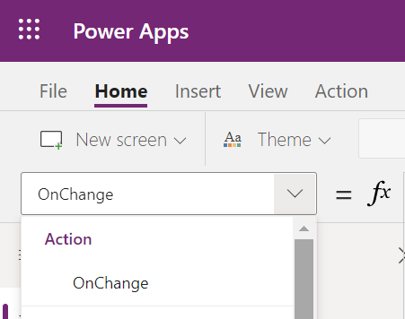
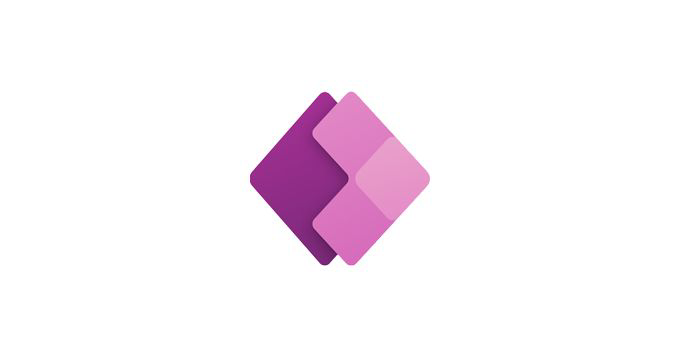

A Workable Pattern for PCF Events You Can Use Today02/04/21, 14:43
# A Workable Pattern for PCF Events
# Yo u   C a n   U s e   To d a y
### March 31, 2021
### There's an easy way to get more events than OnChange in a PCF control
### that's 100% supported and will continue to work, even after proper event
### support is added. It takes surprisingly little extra effort too—let's take a
### look.
### Looking to learn more about the Power Apps Component Framework
before you dive in? This should get you started:
##### Create components with Power Apps Component Framework - Learn
##### Learn how to build custom components and controls with Power Apps component framework.
##### Microsoft DocsDaveBeasley

### If you've created a few Power Apps component framework controls at this
### point, you're aware of the fact that your control gets exactly one event
### that it can fire: OnChange.
https://98.codes/a-workable-pattern-for-pcf-events-you-can-use-today/Page 1 of 6
A Workable Pattern for PCF Events You Can Use Today02/04/21, 14:43

Only one event or "Action" listed for a PCF control: OnChange. RIP Enhanced Formula Bar.
### There is a good way to handle this situation right now that's 100%
### supported and will continue to work, even after proper event support is
### added. It takes surprisingly little extra effort too—let's take a look.
## One new manifest property
### This one is pretty straightforward: add a new simple text property to your
control's manifest file, in this case we've called the property `eventName`. If
### you have more information you need to send along with the event when it
### happens, create properties for those pieces of data as well. I've added an
extra one here called ever so creatively `eventValue`.
Note that both properties are marked as output properties on their usage,
### since these values will always be set from inside your code for use by the
host app. Additionally, we've marked the `required` property of `eventValue`
### as false, as not all events will need a value set:
https://98.codes/a-workable-pattern-for-pcf-events-you-can-use-today/Page 2 of 6
A Workable Pattern for PCF Events You Can Use Today02/04/21, 14:43
```
<?xml version="1.0" encoding="utf-8" ?>
<manifest>
  <control namespace="BlogSamples" constructor="Events" version="0.0.1"
    display-name-key="Events" description-key="Events description"
    control-type="standard">
    <property name="eventName" display-name-key="EventName"
      description-key="The name of the event" of-type="SingleLine.Text"
      usage="output" required="true" />
    <property name="eventValue" display-name-key="EventValue"
      description-key="The value of the event" of-type="SingleLine.Text"
      usage="output" required="false" />
    <resources>
      <code path="index.ts" order="1"/>
    </resources>
  </control>
</manifest>
```
## Figure out the events you need
### In order to keep my code easy to maintain as it grows, I put my event
definitions into an interface in a separate file named `IControlEvent.ts` in
the same directory as my `index.ts` file:
```
// IControlEvent.ts
export interface IControlEvent {
  eventName:
    'OnSelect' |
    'OnConnect' |
    'OnDisconnect'
  eventValue?: string;
}
```
### Then at the top of my main code file, I import that interface so that I can
https://98.codes/a-workable-pattern-for-pcf-events-you-can-use-today/Page 3 of 6
A Workable Pattern for PCF Events You Can Use Today02/04/21, 14:43
### code against it:
```
// index.ts
import { IInputs, IOutputs } from "./generated/ManifestTypes";
import { IControlEvent } from "./IControlEvent";
```
### Now all that's left is to fire those events as they happen using the built-in
### OnChange loop:
1. Yo u r   c o d e     s e ts   u p   a n   eve n t   to   b e   f i re ,  a n d   c a l l s  `notifyOutputChanged`
2. The framework does some stuff and then calls your control's
`getOutputs` function
3. We retrieve the set event information in `getOutputs`, which is then
### sent off to Power Apps
```
// index.ts
private event: IControlEvent;
private notifyOutputChanged: () => void;
public init(
  context: ComponentFramework.Context<IInputs>,
  notifyOutputChanged: () => void,
  state: ComponentFramework.Dictionary,
  container: HTMLDivElement
) {
  // Set up notifyOutputChanged to be called later
  this.notifyOutputChanged = notifyOutputChanged;
}
// And in an event handler already hooked to a button in your control
private connectButtonClicked(): void {
  // Set up the event to be fired
  this.event = {
    name: 'OnConnect',
```
https://98.codes/a-workable-pattern-for-pcf-events-you-can-use-today/Page 4 of 6
A Workable Pattern for PCF Events You Can Use Today02/04/21, 14:43
```
    value = null;
  };

  // and call notifyOutputChanged
  this.notifyOutputChanged();
}
public getOutputs(): IOutputs {
  // Return the set event as the output
  return event;
}
```
### Yo u r   c o n t ro l   w i l l   h ave   a   l o t   m o re   c o d e   a ro u n d   d o i n g   t h e   t h i n g   t h e   c o n t ro l   i s
### actually for, but this is enough to set up the event loop.
## Using these events in an app
In order to use these events, you first use the PowerFx `Switch` function in
your control's `OnChange` behavior property (aka event) to look for each
### possible event coming in, and then react accordingly:
```
// OnChange
Switch(
  Self.EventName,
  "OnSelect",
    Notify("OnSelect received! Selected value: " & Self.EventValue),
  "OnConnect",
    Notify("OnConnect received!"),
  "OnDisconnect"
    Notify("OnDisconnect received!")
)
```
That's all there is to it! Once we have proper event support we can do
### things differently, but this should help until we get there.
https://98.codes/a-workable-pattern-for-pcf-events-you-can-use-today/Page 5 of 6
A Workable Pattern for PCF Events You Can Use Today02/04/21, 14:43
Have feedback? Questions? Head on over to the Power Apps Developer
Community Forum and let us know!
##### Power Apps Pro Dev & ISV
##### This forum is for all professional developers & ISVs looking to build business apps on the Power
##### Platform. It also covers topics like Power Apps component framework, Application Lifecycle
##### Management (ALM) , and how to monitor your apps post AppSource publication via ISV Studio.

https://98.codes/a-workable-pattern-for-pcf-events-you-can-use-today/Page 6 of 6
