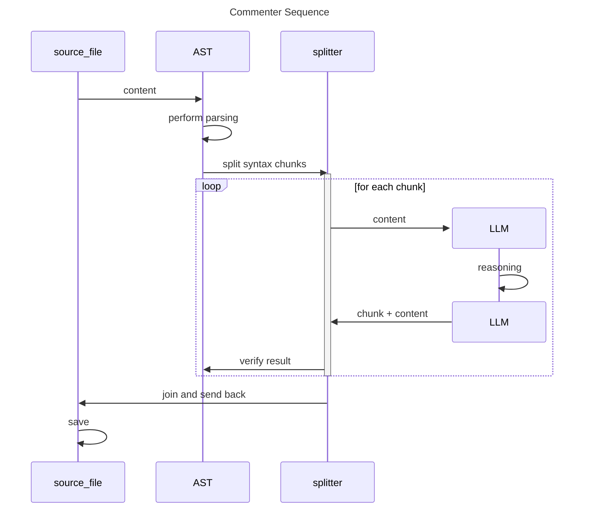

 

## Introduction - Value of documenting code

During my experience in developing Open Source projects, documenting code has become a necessity. Publishing such documentation adds more value and understandability to the project itself.
Now, with the help of AI LLM models, this task is greatly simplified, especially when commenting during day-to-day coding using IDE+LLM integration.

**Question**:
> But, what if I have a big project already delivered and I want to improve its readability by adding more meaningful comments to the already written code?

This seems to me more a batch task that better fit in an AI-Powered Command-Line-Interface (CLI) that can run on code-base and make the dirty-job under the hood. 
So I've decided to challenge me-self in developing of a AI-Commenter-CLI for do that, with the following  requirements:

**Requirements**
* Create a CLI that is able to process a complete code-base. 
* The CLI has to use primarly local LLM models (ollama models).  
* The CLI must works which AI modesl within 7-billion of parameters. 

### GenAIScript comes to play

I've decided to use and Agentic Architecture and, as usual in the classical development experience, I started with the tech-stack-selection searching for the best AI-Agents based frameworks that fit for purpose.
During my experience in AI development I have dealt with several AI-Agents frameworks (like for example langgraph), and everyone provide a great AI agent architecture out-of-box but the real value is in the tools eco-system that which they integrate as standard.
The result of my tech-stack-selection has been the [GenAIScript].

**What is GenAIScript**
> It is an open-source scripting environment that integrates Generative AI capabilities directly into JavaScript, 
enabling developers to programmatically construct prompts for Large Language Models (LLMs) and orchestrate their interactions with various tools and data sources. 
[GenAIScript] facilitates the ingestion of diverse document formats—such as PDFs, DOCX, and CSVs—and supports the generation of structured outputs, including files and edits. 
This functionality streamlines tasks that involve AI analysis  by automating complex processes within a cohesive scripting framework.

### Development Journey

The first good new was that [GenAIScript] already managed the file-system scan using glob pattern. I started experimentation using Ollama, also supported by [GenAIScript], with the local models:

* codellama:7b
* qwen2.5-coder:7b

#### Step 1 - Simplest way (failed)

My first approach was to develop a simple prompt that said "AI, please comment on the code in the specified file". 
The first results were promising, but the larger the source file, the worse the quality of the output and eventually "the hallucinations set in" and the LLM would strangely change the code during the commenting process.

#### Step 2 - RAG approach 

One of the most used technique that is used to reduce context on which the LLM have to reason is to use Retrieval-Augmented-Generation (RAG). 
This technique is based on dividing the source information into well-defined blocks that should be as meaningful as possible, and indexing them using different approach where one of the most famous is using semantic vector generation.
So the question became:

> How can divide a source code file in meaningful part can could be commented as much possible in independent way ?

The answer is using **Abstract Syntax Tree (AST)**

**Abstract Syntax Tree (AST)**
> This approach involves analyzing the structure of code by parsing it into a tree-like representation where each node corresponds to a construct in the source code, such as variables, expressions, or statements. 
> The AST provides a hierarchical view of the code's syntax, abstracting away irrelevant details like formatting.

Using the AST, we can provide to AI consistent piece of code so it can:
* Focus on particular Code Structure of interest: like class declarations, methods declarations, etc ...
* Generate Contextual Comments: Identify what each construct does and suggest comments directly tied to the logic or intent of the code.
* Ensure Accuracy: By operating on the AST, AI avoids misinterpretation caused by large context and ambiguous code formatting.
 
 This approach is especially powerful because it works with the intrinsic structure of the code, ensuring precise and context-aware documentation.

##### GenAIScript comes to rescue

Now the problem was to find a AST framework supporting as many programming languages as possible for developing and testing this new approach based on RAG technique.
As sayed previously when we choose a tech-stack it is very important the eco-system and, in the case of [GenAIScript], 
the choice was really right because it comes with [Tree-Sitter] an AST tool with an incremental parsing library that can build a concrete syntax tree for a source file.

#### Step 3 - Implementing Commenter per Java file

Once I've verified Java support by [Tree-Sitter], I started implementation of the Commenter CLI. The sequence diagram below summarize the main steps of implementation

As you can see from diagram the implementation is composed by the following steps:

1. Each Java source file is loaded an the content submitted to AST
2. AST extract syntax tree and invoke Splitter
3. Splitter extracts all the language constructs of interest (in the case of comment we have interest in syntax declaration like class, interface, records, methods, etc ... ) and produces the chunks
4. for each chunk the LLM model is invoked and the chunk itself is provided to LLM that reviews the implementation and produces its comment accordly
5. Comment + Chunk is provided back to AST parser to verify that what LLM has produced is still valid in Java
6. Finally all the chunk and related comments are joined and saved back to the file

## Conclusion

[GenAIScript]: https://microsoft.github.io/genaiscript/]
[Tree-Sitter]: https://tree-sitter.github.io/tree-sitter/