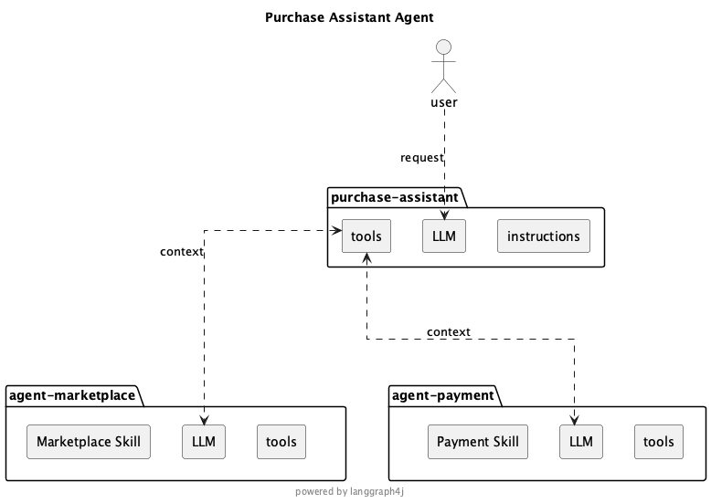
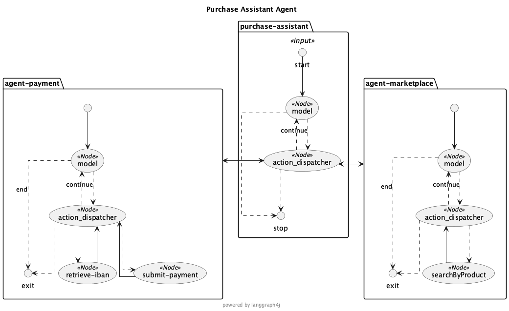

Building Skill-Based Sub-Agents with LangGraph4j and Spring AI

## Abstract

Modern agentic systems usually expose two strong but separate abstractions:

* **Tools**, which give an LLM executable capabilities
* **Skills**, which package reusable instructions for a narrow task

This article shows how to combine both ideas in [LangGraph4j] so that a skill is not just prompt text, but a fully operational **sub-agent exposed as a tool**. The result is a practical pattern for building modular multi-agent systems in Java with **[Spring AI]** and **[LangGraph4j]**, while keeping each agent focused, reusable, and low in context cost.

Starting from a standard ReACT agent, the approach implemented is quite simple.

1. Load a `SKILL.md` file
2. Read its front matter to define the tool contract ( name and argument description)
3. Use the skill body as the sub-agent system prompt
4. Restrict the sub-agent to only the tools declared by the skill
5. Register the sub-agent in a parent ReAct agent as if it were a normal tool

In other words, a skill becomes an *executable tool-backed agent*.

## Why This Pattern Matters

The standard ReAct pattern already gives an LLM a strong execution model: reason, choose a tool, inspect the result, and continue until the task is complete. That model is useful because the LLM does not need to commit to a fixed plan up front. It can adapt after every tool call.

The next step is to let a tool itself be implemented by another agent.

Once that happens, the parent agent is no longer forced to know every operational detail. It only needs to know:

* which specialized capability exists
* when to invoke it
* what input to pass

The specialized logic is delegated to a narrower agent with its own instructions and its own restricted toolset. This gives us a clean **sub-agent architecture** without inventing a new orchestration primitive. We reuse the same tool-calling semantics that ReAct agents already understand well.

<!--
## Advantages

There are multiple advantages to use this approach:

### Reuse Tool execution plan (coordination)

One of the most important feature of the LLM, since from beginnig, was able to define a tool execution planning to resolve the problem. The ReAct agent was introdced to add an execution layer and an evaluation loop to execute tools and involve again LLM,  based on tool execution result in order to dynamically revaluate the execution planning itself.
If we consider that a tool can involve a ReACT agent in turn we gain the sub agent involvment that colud involve other sub agents in turn in a iterative way

### Minimize agent context (less token)

Declaring a sub agent as a tool, when its parent agent plan to call it, it provides the information requested by sub agent extracting them from the current context automatically reducing them for the specific call. This guarantee that the sub agent receives only the required information that become the user input for it.
Moreover for each sub agents we can declare the `allowed-tools` that further leaning the context making the agent more efficient and effective
-->

## Why Reusing Tool Semantics Is Powerful

One of the most valuable properties of LLM-based agents is their ability to build and revise a tool execution plan while reasoning over intermediate results. ReAct made this practical by combining thought, action, and observation in a loop.

When a tool call can transparently invoke another agent, we preserve that planning model instead of replacing it.

The parent agent can:

* decide that a specialized capability is needed
* provide only the task-relevant context
* wait for a result exactly as it would for a standard tool

The child agent can:

* run its own reasoning loop
* invoke its own allowed tools
* return a compact outcome to the parent

This gives hierarchical coordination without exposing the full inner workflow to the parent prompt.

## Minimizing Context and Token Usage

This pattern also improves context discipline.

Without sub-agents, a single generalist agent often needs:

* every tool definition
* all operating instructions for every domain
* every procedural rule in one large system prompt

That quickly becomes expensive and unreliable.

With skill-based sub-agents:

* the parent only sees high-level capabilities
* each child sees only the instructions relevant to its task
* each child receives only the tools it is allowed to use

This narrower context has practical benefits:

* fewer tokens sent to the model
* lower prompt interference between unrelated domains
* clearer tool choice
* better modularity as the system grows

> The `allowed-tools` skill property plays an important role here anabling tool filtering. It turns tool access into an explicit design decision instead of an accidental side effect of what happened to be registered globally.

## Reference implementation

I've started implementation in the new [LangGraph4j] release stream `1.9` currently in active development. The implementation is centered on [`SkilledReactSubAgent`], which turns a markdown skill into both:

* a compiled LangGraph4j sub-graph
* a Spring AI tool (i.e. `ToolCallback`)

That means the same component can participate in the graph as an agent and present itself to the parent LLM as a callable tool.

In particular the flow is:

1. Parse the `SKILL.md`
2. Extract `name` and `description` from front matter
3. Optionally filter tools using `allowed-tools`
4. Use the markdown body as the sub-agent instructions
5. Compile the agent
6. Wrap it into a function tool whose input is a single `context` field

> The important design choice is that the **tool definition is derived from the skill metadata**, while the **agent behavior is derived from the skill content**.

### Skill Format

The supported skill format is 

```
---
name: <agent name>
description: |
        <multi line description>
allowed-tools: <list of tools>
---

<skill body>
```

### From Skill to Tool-Backed Agent

The conversion happens in `SkilledReactSubAgent.Builder#build(...)`. This is the crucial bridge where:

* the skill metadata defines the external API
* the skill body defines the internal operating behavior
* the allowed tools define the sub-agent execution boundary

The resulting agent is then wrapped as a Spring AI function tool.

> From the parent agent point of view, this is just another tool. Internally, it is a complete ReAct-capable agent workflow.


## Examples

### Purchase Assistant Agent

This is an agent that allow to select a produdct from a reference marketplace and purchase it. Below the simplified component diagram



### Marketplace Skill
```md
---
name: agent-marketplace
description: |
    marketplace agent, ask for information about products. This is agent that provides the information on the product marketplace.
    required data are:
    * product name
allowed-tools: searchByProduct
---

## Retrieve product information
We need all information about about the product of interest in particular is mandatory to have
* product name

with such information we have to invoke tool `searchByProduct` and return the result
```
### Payment Skill

```md
---
name: agent-payment
description: |
    payment agent, this is the agent that provides payment service.
    required data are:
    * Product name
    * Product price
    * Product currency
    * the International Bank Account Number (IBAN) - optional

allowed-tools:
    - submit-payment
    - retrieve-iban
---

## submit a payment for purchasing a specific product
We need all information about purchasing to allow the payment

* Product name
* Product price
* Product price currency
* International Bank Account Number (IBAN)

With such information you must invoke tool `submit-payment` and return the result of the payment transaction plus the IBAN.
If IBAN is not provided invoke tool `retrieve-iban` to retrieve the required IBAN.

```

Observing the skills above they define three different concerns:

* `name`: the tool name exposed to the parent agent
* `description`: the tool description shown to the model
* `allowed-tools`: the only tools available inside the sub-agent

Everything after the front matter becomes the sub-agent system prompt.

> Again, this is a strong separation of concerns. The parent agent sees a concise tool contract, while the child agent receives richer operating instructions.

## Finally the code

Below a representative code snippet that show how wires two skill-based sub-agents into a parent agent:

```java
var subAgentMarketplace = SkilledReactSubAgent.builder()
        .chatModel(chatModel)
        .tools(Marketplace.tools())
        .build(compileConfig,
                SkillSource.of(Paths.get("skills/agent-marketplace/")));

var subAgentPayment = SkilledReactSubAgent.builder()
        .chatModel(chatModel)
        .tools(Payment.tools())
        .build(compileConfig,
                SkillSource.of(Paths.get("skills/agent-payment/")));

var purchaseAgent = AgentExecutorEx.builder()
        .chatModel(chatModel)
        .tool(subAgentMarketplace)
        .tool(subAgentPayment)
        .build(compileConfig);

var input = """
        search for product 'X'.
        If found proceed to payment with IBAN US82WEST1234567890123456 
        to purchase it
        """;

var result = purchaseAgent.invoke( 
        GraphInput.args( Map.of("messages", new UserMessage(input) )), runnableConfig); 

```

This composition is interesting because the purchase agent (the parent) does not need detailed knowledge of:

* how product lookup works
* how payment submission works
* when IBAN retrieval is required

Those rules are delegated to the sub agents themselves.

That is a simple but good example of behavioral encapsulation. The parent agent only decides to involve marketplace agent to retrieve product and after that to involve payment agent to purchase.

This is a very basic but representative example, it is useful because it shows the intended layering:

* the user gives a single business request
* the parent agent decomposes the work
* specialized sub-agents execute their own logic
* the final answer comes back through the normal tool-response path

> Interesting note that each sub agent, potentially, can relies on different LLM chat model so we can further optimize overall agent execution process

Below a more detailed componet diagram generated by [LangGraph4j] itself.



From this diagram it is quite clear that the sub agents are nothing but sub-graphs


## Testing the Pattern

The repository includes an integration-style test in [`SubAgentITest.java`](/Users/bsorrentino/WORKSPACES/GITHUB.langgraph4j/experimental/langgraph4j-agents/examples/src/test/java/org/bsc/langgraph4j/spring/ai/agent/SubAgentITest.java) that demonstrates this composition in a realistic flow:

```java
final var input = """
search for product 'X'.
If found proceed to payment with IBAN US82WEST1234567890123456 and purchase it
""";

final var result = agentMarketplace.invoke(
        GraphInput.args(Map.of("messages", new UserMessage(input))),
        runnableConfig);
```

The test is useful because it shows the intended layering:

* the user gives a single business request
* the parent agent decomposes the work
* specialized sub-agents execute their own logic
* the final answer comes back through the normal tool-response path

The same pattern is also applied to a commit assistant example, showing that the approach is not limited to business workflows. It can also orchestrate developer tooling.

## Design Advantages

This approach has several practical advantages.

### 1. Reuse Existing Agent Patterns

There is no need to invent a separate orchestration protocol for sub-agents. A sub-agent is exposed as a tool, so the parent agent can use standard ReAct behavior without extra prompting complexity.

### 2. Better Modularity

Each skill owns:

* its tool-facing identity
* its internal instructions
* its allowed tool boundary

That makes the system easier to evolve than a single monolithic agent prompt.

### 3. Smaller and Cleaner Context

The child agent receives only what it needs. This reduces token usage and lowers the risk that unrelated instructions distort tool choice or task execution.

### 4. Safer Capability Scoping

By filtering tools from `allowed-tools`, the framework prevents a child agent from accidentally seeing tools outside its intended domain.

### 5. Better Reusability

A skill can be packaged, versioned, and reused across different parent agents. The same marketplace or payment skill can participate in many workflows as long as the tool contract remains stable.

## Tradeoffs and Implementation Considerations

This pattern is strong, but it is not free of tradeoffs.

### The Parent Must Summarize Well

Because the child receives a single `context` field, the parent agent needs to pass the relevant facts clearly. If critical information is omitted, the child may need extra recovery steps or may fail to act.

### Tool Descriptions Matter More

Since the parent sees the child as a tool, the `name` and `description` fields in the skill front matter become part of the routing surface for the LLM. Weak metadata will reduce invocation quality.

### Prompt Boundaries Need Discipline

The skill body is effectively the child system prompt. If it is vague, contradictory, or overloaded, the benefits of modularity disappear. Skills need to stay focused.

### Observability Is Important

Nested agents can make execution harder to inspect if tracing is weak. LangGraph4j's graph structure and step streaming help here, but production systems should still invest in logging and traceability.

## Why LangGraph4j Fits This Well

LangGraph4j is a good fit for this pattern because it already models agent workflows as explicit graphs and integrates naturally with Spring AI tool abstractions.

That matters for two reasons:

* the sub-agent is not just prompt composition; it is a compiled graph with state and execution hooks
* the parent integration remains ergonomic because Spring AI already treats capabilities as tools

So the implementation is not forcing two incompatible ideas together. It is aligning:

* LangGraph4j graph execution
* Spring AI tool calling
* markdown-defined skills

into a single reusable agent-building pattern.

## Conclusion

Treating a skill as an executable tool-backed sub-agent is a simple but powerful architectural move.

It lets us:

* preserve the strengths of the ReAct loop
* delegate specialized behavior cleanly
* reduce context size
* constrain tool access per domain
* build multi-agent systems out of reusable skill modules

The idea is implemented in a compact and pragmatic way: a `SKILL.md` file becomes the source of both the sub-agent prompt and the tool contract exposed to the parent agent.

For Java teams building agentic applications with Spring AI and LangGraph4j, this is a practical pattern for moving from a single large agent toward a modular multi-agent design without abandoning the tool semantics that current LLMs already handle well.

The implementation is in progress on release `1.9-SNAPSHOT` in develop branch of [LangGraph4j] repository but the first result are very promising.

Hope this could help and encourage usage of [LangGraph4j] for your next Agentic Workflow. Checkout project, try it and let me know your feedback and... happy AI coding! 👋


[LangGraph4j]: https://github.com/langgraph4j/langgraph4j
[Spring AI]: https://spring.io/projects/spring-ai
