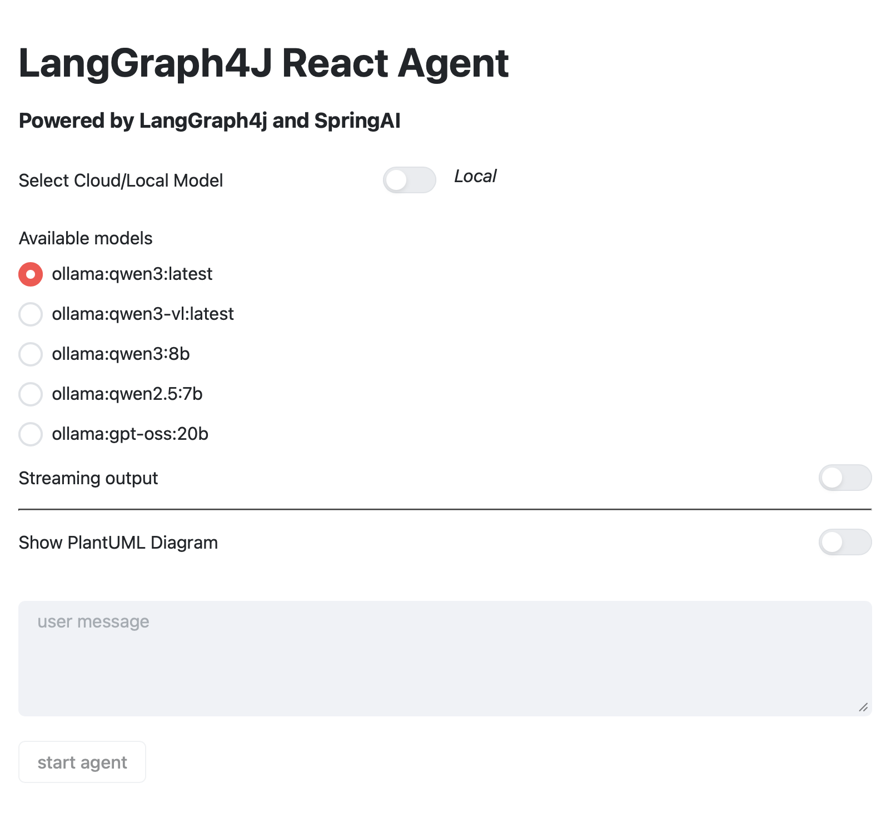
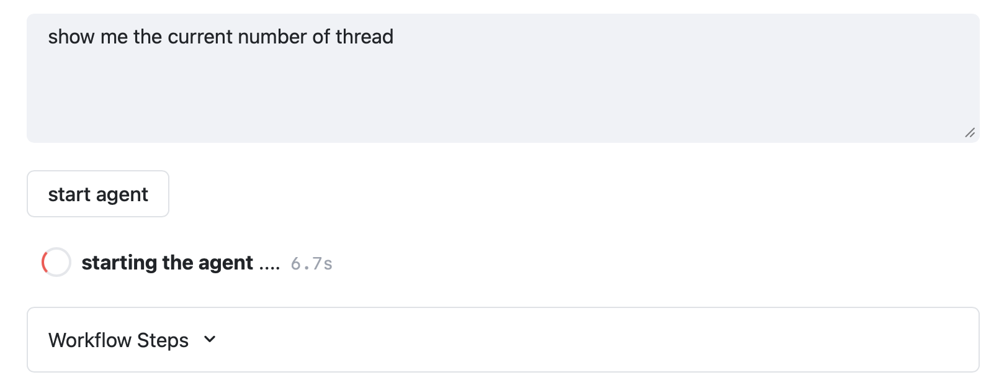
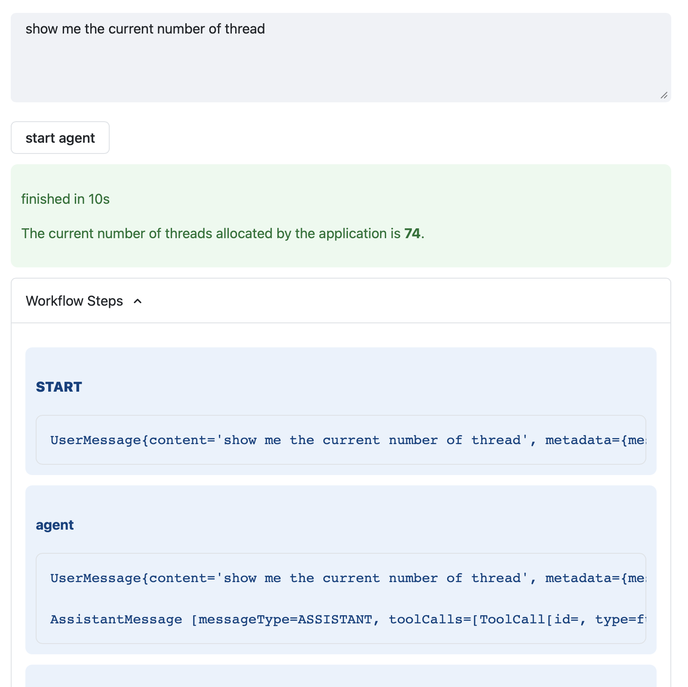

# Experimenting with Javelit the Streamlit for Java

## Introduction

### Starting from Phyton development ecosystem 

At beginning of my experience in working with Agentic Applications I've started working with Python using LangChain/LangGraph using, for testing and documenting purposes,  the simply but powerful Jupyter Notebooks. 
In the sametime to move on rapid prototyping I've used the amazing Streamlit Python framework , that allowed me to create quickly working app with a effective UI and a good UX 

### moving to the Java one

When I started developing [LangGraph4j], I tried to replicate my Python development ecosystem in Java. I then experimented with Java Notebooks through the [rapaio-jupyter-kernel] project, which allowed me to replicate the development experience I had with Jupyter Notebooks in Python quite well. For rapid prototyping, I relied almost entirely on Spring Boot framework, which is a fairly fast and enjoyable programming experience.

### Javelit come to play 

Going on my efforts on [LangGraph4j] and continuously monitoring the most interesting and promising Java projects on GitHub, I discovered [Javelit]. This project intrigued me because of its reference to [Streamlit], and after a review, I was amazed to realize that the dynamic programming model popularized by Streamlit had been adapted for Java by this initiative, which is cool.
So I started to evaluate it as part of may java development ecosystem and below i'll share with you my experience about it.


#### What's javelit

[Javelit] is a tool to quickly build interactive app frontends in Java, particularly for data apps, but it’s not limited to them. It helps you quickly develop rapid prototypes, with a live-reload loop, so that you can quickly experiment and update the app instantly.

How it works
> Javelit’s architecture allows you to write apps the same way you write plain Java methods. Any time something must be updated on the screen, Javelit reruns your entire Java main method from top to bottom.

So you have to think about it **as if your entire UI code runs inside a continuous loop** that refreshes whenever something needs updating on the screen.

[Javelit] provides developers with a rich set of prebuilt [components](https://docs.javelit.io/develop/api-reference) that make it easy to get started. 

Just to provide you an idea of the [Javelit] approach below the inevitable "Hello World" code snippet

```java
/// usr/bin/env jbang "$0" "$@" ; exit $?
import io.javelit.core.Jt;

public class App {

    public static void main(String[] args) {
        Jt.title("Hello World!").use();
        Jt.markdown("""
            ## My first official message
            Hello World!
            """).use();
    }
}
```

Then, once [Javelit] is [installed](https://docs.javelit.io/get-started/installation/standalone#install-javelit), you’d run it with the following command:

```
javelit run App.java
```

## Use Javelit with LangGraph4j

I've decided to use [Javelit] to develop some examples of [LangGraph4j] usage and below I'll show you how have used [Javelit] to implement a demo app to run the **LangGraph4j powerd React Agent**. 
For simplicity I'll report only the main code snippets but for a complete code take a look to [] for [spring AI] based implementation or [`JtAgentExecutorApp.java`](https://github.com/langgraph4j/langgraph4j/blob/main/spring-ai/spring-ai-agent/src/test/java/JtAgentExecutorApp.java) for the LangChain4j based implementation. 

As [Streamlit] in [Javelit] entire application constist in just one `main` method.

```java
public class JtAgentExecutorApp {

    public static void main(String[] args) {

        Jt.title("LangGraph4J React Agent").use();

        try {
            // create a LangGraph4j Agent
            var agent = AgentExecutor.builder()
                .chatModel(/* instantiate the preferred ChatModel */)
                .toolsFromObject( new MyTools() /* Custom Tools */  )
                .build()
                .compile(); 

            // input: the user message
            var userMessage = Jt.textArea("user message:")
                    .placeholder("user message")
                    .labelVisibility(JtComponent.LabelVisibility.HIDDEN)
                    .use();

            // button: start agent processing 
            var start = Jt.button("start agent")
                    .disabled(userMessage.isBlank())
                    .use();

            if (start) { // if button pressed

                var outputComponent = Jt.expander("Workflow Steps").use();

                var input = GraphInput.args(Map.of("messages", new UserMessage(userMessage)));

                var generator = agent.stream(input);

                final var startTime = Instant.now();

                for( var step : generator ) {
                
                    Jt.sessionState().remove("streaming");
                    Jt.info("""
                            #### %s
                            %s
                            """.formatted(s.node(),
                            s.state().messages().stream()
                                    .map(Object::toString)
                                    .collect(Collectors.joining("\n\n")))
                    ).use(outputComponent);
                }

                final var elapsedTime = Duration.between(startTime, Instant.now());

                Jt.success("finished in %ds%n".formatted(elapsedTime.toSeconds())).use();
                
            }
        } catch (Exception e) {
            Jt.error(e.getMessage()).use();
        }

    }

}
```

The output of the [Javelit] app looks like:

#### Chat model selection


#### Start agent



#### Results


## 👉 try yourself 👀 🚀 🤯

If you want try jourself (after installed [javelit]) run the command 
```
javelit run https://github.com/langgraph4j/langgraph4j/tree/main/spring-ai/spring-ai-agent/src/test/java
```

## Conclusion

## References

* [Javelit to create quick interactive app frontends in Java](https://glaforge.dev/posts/2025/10/24/javelit-to-create-quick-interactive-app-frontends-in-java/)

[Javelit]: https://javelit.io
[jbang]: https://www.jbang.dev/

