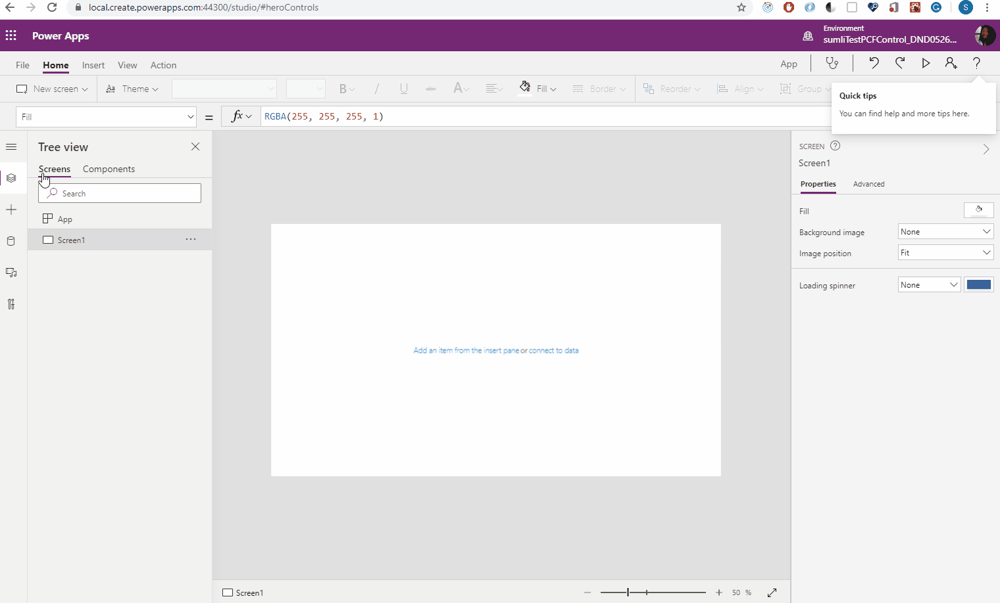

# Support events in PCF control

PCF control has added support for events on Canvas Apps. It allows a control to declare events in the control manifest, and invoke the events from within the control.

When the control is rendered in Canvas, the event will display in the Formula Bar, as well as in the Advanced Properties panel, so that the event can be set to a formula, and App makers can respond to the control event.

## 1. Manifest Declaration

Reference: [ManifestSchema.xsd](https://dynamicscrm.visualstudio.com/OneCRM/_git/CRM.Client.ControlFramework?path=%2Fresources%2FManifestSchema.xsd&version=GBmaster&line=289&lineEnd=306&lineStartColumn=15&lineEndColumn=77&lineStyle=plain)

### \<event> Element:
The event node defines a custom event for the control.

### \<event> Attributes:

Name | Description | Type | Required
--- | --- | --- | ---
name | Name of the event. Must not be one of the reserved common-event names.| string | Yes
display-name-key | Used in the customization screens as localized strings that describes the name of the event. | string | No
description-key | Used in the customization screens as localized strings that describes the description of the event. | string | No
hidden | Whether or not the event should be hidden on Canvas app. If not specified, by default is 'false' | boolean<br>[Remarks](https://dynamicscrm.visualstudio.com/OneCRM/_wiki/wikis/OneCRM.wiki/6886/Support-events-in-PCF-control?anchor=**remarks%3A**) | No

### \<common-event> Element:

The common-event node declares a system common event for the control. Canvas framework has implemented default behavior for some events. Declaring such events as 'common-event' allows your control to benefit from framework, also to be consistent with other native controls' behavior on Canvas.

### \<common-event> Attributes:

 Name | Description | Type |Required
 --- | --- | --- | ---
name | Name of the common-event. Must be one of the names defined in commonEventType.| commonEventType<br>[Remarks](https://dynamicscrm.visualstudio.com/OneCRM/_wiki/wikis/OneCRM.wiki/6886/Support-events-in-PCF-control?anchor=**remarks%3A**) | Yes


### Remarks:

Type | Description
---| --
boolean | Enum of `true`, `false`
commonEventType | Enum of `OnSelect`, `OnChange`

## 2. Control Invocation
The event can be invoked within a control through control context API: `context.events.<event_name>()`. See **4. Usage Examples** below.

## 3. Build with Tooling

The tooling support for event is implemented in this [PR](https://msazure.visualstudio.com/One/_git/PowerPlatform-ISVEx-ToolsCore/pullrequest/3046238).

Within above PR, the tooling has also added manifest validation for event and common-event node:
* 'common-event' name must be one of the names defined in commonEventType, case sensitive;
* 'event-name' must not be one of the names defined in commonEventType, case insensitive;
* There must be no duplicate names for 'event' or 'common-event' nodes respectively;
* Other checks based on the manifest schema.

For 1st party / 3rd party PCF control build with tooling, See **4. Usage Examples** below.

## 4. Usage Examples

#### 1) Add "OnClick" event to 1st Party Button PAC control: [Sample PR](https://dynamicscrm.visualstudio.com/OneCRM/_git/CRM.Client.Controls/pullrequest/453536)

#### Manifest Declaration

```xml
<?xml version="1.0" encoding="utf-8" ?>
<manifest>
  <control namespace="Microsoft.CoreControls" constructor="Button" version="0.2.0" display-name-key="Button_Di
    <!-- snippet -->
    <!-- Declare 'OnClick' event in the manfiest -->
    <event name="OnClick" display-name-key="CC_OnClick" description-key="CC_OnClick_Desc"/>
  </control>
</manifest>
```

#### Control Invocation

```javascript
public updateView(context: IPropBag<IInputs>): VirtualComponent {
    // snippet
    React.createElement(ButtonComponent, {
        buttonProps: {
          // Invoke event from context propertyBag
          onClick: context.events.OnClick,
        },
    }
}
```

#### Build (with updated tooling version in CRM.Client.Controls repo)

* Update `'pcf-scripts'`, `'pcf-start'` `in package.json` to `'1.3.4'`
* Update `featureconfig.json` to add `"pcfAllowEvents": "on"`
* `<CRM.Client.Controls_repo>\src\PACControls\CoreControls\Button>msbuild Button.csproj`

#### 2) Add events and common-events to 3rd Party PCF control:

#### Manifest Declaration

```xml
<?xml version="1.0" encoding="UTF-8" standalone="yes"?>
<manifest>
  <control namespace="SampleNamespace" constructor="TSIFrameControl" version="1.1.0" display-name-key="TS_IFra
 <!-- snippet -->
        <!-- Declare 2 custom events and 1 common-event in the manifest -->
 <event name="OnTest" display-name-key="CC_OnTest" description-key="CC_OnTest_Desc" hidden="false"/>
 <event name="OnTestHidden" display-name-key="CC_OnTestHidden" description-key="CC_OnTestHidden_Desc" h
 <common-event name="OnChange"/>
  </control>
</manifest>
```

#### Control Invocation

```javascript
public updateView(context: ComponentFramework.Context<IInputs>) {
    // snippet
    this.renderOnTestLink(context);
    this.renderOnChangeLink(context);    
}
private renderOnTestLink(context: ComponentFramework.Context<IInputs>): void {
    const clickMeLink = document.createElement("div");
    clickMeLink.textContent = "OnTest";
    clickMeLink.addEventListener("click", () => {
        // Invoke event from context propertyBag
        context.events.OnTest();
    })
    this._container.appendChild(clickMeLink);
}
private renderOnChangeLink(context: ComponentFramework.Context<IInputs>): void {
    const clickMeLink = document.createElement("div");
    clickMeLink.textContent = "OnChange";
    clickMeLink.addEventListener("click", () => {
        // Invoke event from context propertyBag
        context.events.OnChange();
    })
    this._container.appendChild(clickMeLink);
}
```

#### Build (with updated tooling version in Power Apps CLI)

`<your_control_repo>npm run build`

Reference: [How-to guides](https://docs.microsoft.com/en-us/powerapps/developer/component-framework/create-custom-controls-using-pcf)

#### Use in Canvas app


