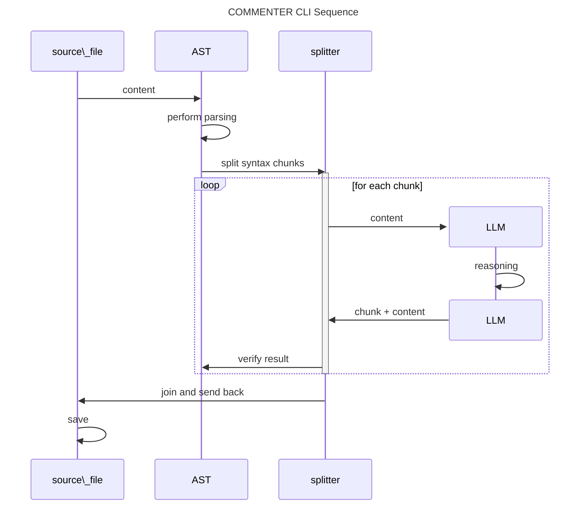

 
 

## **Introduction - Value of documenting code**

During my experience in developing Open Source projects, documenting code has become a necessity. Publishing such documentation adds more value and understandability to the project itself. Now, with the help of AI LLM models, this task is greatly simplified, especially when commenting during day-to-day coding using IDE+LLM integration.

**Question**:

> But, what if I have a big project already delivered and I want to improve its readability by adding more meaningful comments to the already written code?

I believe this task is better suited for a batch processing approach, which can be implemented using an AI-powered Command-Line Interface (CLI) that can run on code-base and do the dirty-job under the hood. So I've decided to challenge myself in developing such a CLI with the following requirements:

**Requirements**

- Create a CLI that is able to process a complete code-base.
- The CLI has to use primarily local LLM models ([Ollama] models).
- The CLI must work with AI models within 7-billion parameters.

### **GenAIScript comes to play**

I've decided to use Agentic Architecture and, as usual in the classical development experience, I started with the tech-stack-selection searching for the best AI-Agents based frameworks that fit for purpose. During my experience in AI development I have dealt with several AI-Agents frameworks (like for example langgraph), and everyone provides a great AI agent architecture out-of-box but the real value is in the tools ecosystem that they integrate as standard. The result of my tech-stack-selection has been the [GenAIScript].

#### **What is GenAIScript**

It is an open-source scripting environment that integrates Generative AI capabilities directly into JavaScript, enabling developers to programmatically construct prompts for Large Language Models (LLMs) and orchestrate their interactions with various tools and data sources. [GenAIScript] facilitates the ingestion of diverse document formats—such as PDFs, DOCX, and CSVs—and supports the generation of structured outputs, including files and edits. This functionality streamlines tasks that involve AI analysis by automating complex processes within a cohesive scripting framework.

### **Development Journey**

The first good news was that [GenAIScript] already managed the file-system scan using glob pattern. I started experimentation using [Ollama], also supported by [GenAIScript], with the local models:

- [codellama:7b]
- [qwen2.5-coder:7b]

#### **Step 1 - Simplest way (failed)**

My first approach was to develop a simple prompt that said "AI, please comment on the code in the specified file". The first results were promising, but the larger the source file, the worse the quality of the output and eventually "the hallucinations set in" and the LLM would strangely change the code during the commenting process.

#### **Step 2 - RAG approach**

One of the most used techniques for reducing context on which the LLM has to reason is to use Retrieval-Augmented-Generation (RAG). This technique is based on dividing the source information into well-defined blocks that should be as meaningful as possible, and indexing them using a different approach where one of the most famous is using semantic vector generation. So the question became:

How can I divide a source code file into meaningful pieces that could be commented on as much as possible in an independent way?

The answer is the **Abstract Syntax Tree (AST)**.

#### **Abstract Syntax Tree (AST)**

This approach involves analyzing the structure of code by parsing it into a tree-like representation where each node corresponds to a construct in the source code, such as variables, expressions, or statements. The AST provides a hierarchical view of the code's syntax, abstracting away irrelevant details like formatting.

Using the AST, we can provide to AI consistent pieces of code so it can:

- Focus on particular Code Structures of interest: like class declarations, methods declarations, etc.
- Generate Contextual Comments: Identify what each construct does and suggest comments directly tied to the logic or intent of the code.
- Ensure Accuracy: By operating on the AST, AI avoids misinterpretation caused by large context and ambiguous code formatting.

This approach is especially powerful because it works with the intrinsic structure of the code, ensuring precise and context-aware documentation.

#### **GenAIScript comes to rescue 🚀**

Now the problem was to find an AST framework supporting as many programming languages as possible for developing and testing this new approach based on the RAG technique. As said previously, when we choose a tech stack it is very important to consider the ecosystem and, in the case of [GenAIScript](https://microsoft.github.io/genaiscript/), the choice was really right because it comes with [Tree-Sitter], an AST tool with an incremental parsing library that can build a concrete syntax tree for a source file.

#### **Step 3 - Implementing Commenter per Source File**

Once I verified that [Tree-Sitter] supported multiple programming languages, which my first interest was for Javascript, Typescript and Java, I started implementing the Commenter CLI. The sequence diagram below summarizes the main steps of the implementation.

<!--

-->

As you can see from the diagram, the implementation is composed of the following steps:

1. Each source file is loaded, and its content is submitted to the AST parser.
2. The AST extracts a syntax tree and invokes the Splitter.
3. The Splitter extracts all the language constructs of interest (e.g., declarations of functions, interfaces, method, etc.) and produces code chunks.
4. For each chunk, the LLM model is invoked, and the chunk itself is provided to the LLM, which reviews the implementation and produces its comment accordingly.
5. The Comment + Chunk is provided back to the AST parser to verify that what the LLM has produced is still valid code for the given language.
6. Finally, all chunks and related comments are joined and saved back to the file.

## **Conclusion**

In this article, we explored a technique to use AI for generating high-quality comments for existing code within a codebase. This method can be applied to **any programming language supported by the AST framework**.

This method not only saves time but also improves the overall quality of the documentation, making it easier for developers to understand and work with the codebase.

During development, I found that the [qwen2.5-coder:7b] model worked very well for code commenting tasks. So, I've decided to use it for the first release of the tool.

If you want to give a try to the **Commenter tool**, check it out from [github project][project].

In the meanwhile, Happy AI coding! 👋

[project]: https://github.com/bsorrentino/genaiscript-labs
[GenAIScript]: https://microsoft.github.io/genaiscript/
[Tree-Sitter]: https://tree-sitter.github.io/tree-sitter/
[ollama]: https://ollama.com
[codellama:7b]: https://ollama.com/library/codellama
[qwen2.5-coder:7b]: https://ollama.com/library/qwen2.5-coder