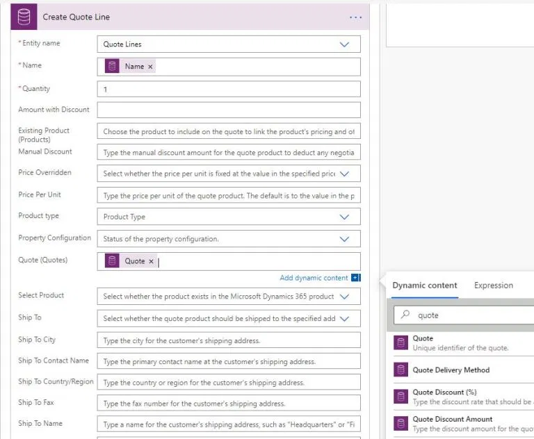
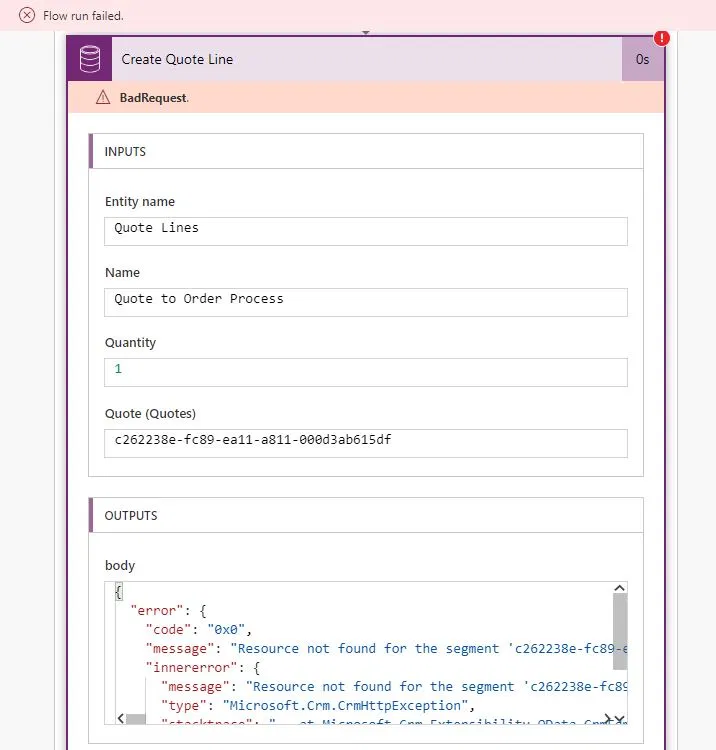
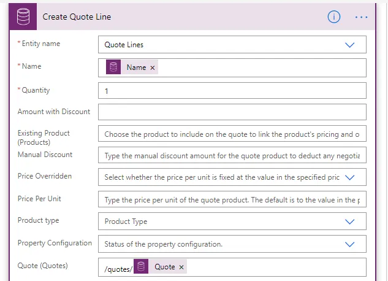
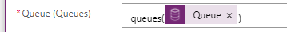
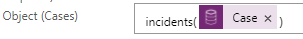

## How to solve Power Automate error: "Resource not found for the segment"

Recently , I have faced with this issue and I've spent time in trying and searching a solution. Luckily I landed on this [article](https://powerofpowerplatform.com/resource-not-found-for-the-segment-issue-in-power-automate-microsoft-flow/) that gave me the right info to solve it.

So I've decided to summarize the solution below:

### Problem

The issue happen when in Power Automate try to create a record using “**Create a new record**” action with **Common Data Service(Current environment)** connector based on some trigger and have to **reference a related record**

This sounds a simple job right !!! No, it's not.

Let’s see an example.

If you just referring the **unique id** (_as in the image below_)


 
After running the flow  got failed with 

> Resource not found for the segment ‘c262238e-fc89-ea12-ba11-000d3ab615df'
 

 
The problem is the **CDS( Current environment) connector** itself that, unlike the **CDS Connector**, it expects referenced attribute values in “**OData Id**” format i.e.:
```
/[EntityNameInPlural]([Record’sId/GUID]).
```

So, in the example case, for quote lookup attribute the value is:  `/quotes/(Record’s Id/GUID)`.
 

 
After making the above change, flow run successfully.
 
As said the interesting thing is **if you use old CDS connector, you wont face this issue**. But we cannot be compromised to use old one cause the new connector gives us lot of advantages, like the option to [configure multiple trigger](https://powerofpowerplatform.com/when-a-record-is-created-updated-or-deleted-trigger-for-cds-power-automate/).
 
If you want to know the difference between CDS vs CDS (Current environment) connectors, refer this excellent [article](https://saralagerquist.com/2019/12/15/cds-vs-cds-what-connector-should-i-use-in-power-automate/) by **Sara Lagerquist (MVP)**
 
### system entity lookups versus custom entity lookups

Below is the syntax that works for me for system entity lookups versus custom entity lookups. 
 
#### Setting a lookup to a system entity:

``` 
[system entity plural name]([variable])
```

For example:

##### Queues: 



##### Cases:




#### Setting a lookup to a custom entity:

```
/[prefix_entitypluralname]([variable])
```
 
For example:

##### Due Diligence: 


## References

* [Original Post](https://powerofpowerplatform.com/resource-not-found-for-the-segment-issue-in-power-automate-microsoft-flow/)
* [Microsoft Power Automate Community ](https://powerusers.microsoft.com/t5/Power-Automate-Community-Blog/Resource-not-found-for-the-segment-issue-in-Power-Automate/ba-p/552837)
