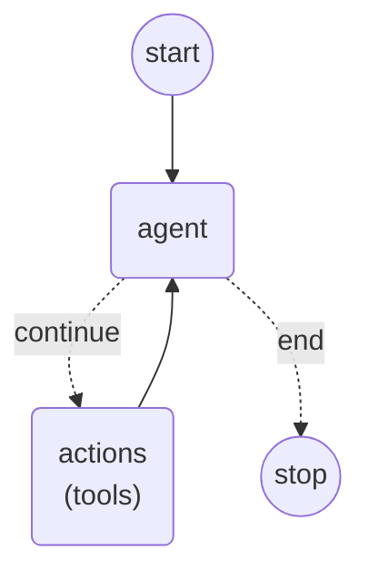
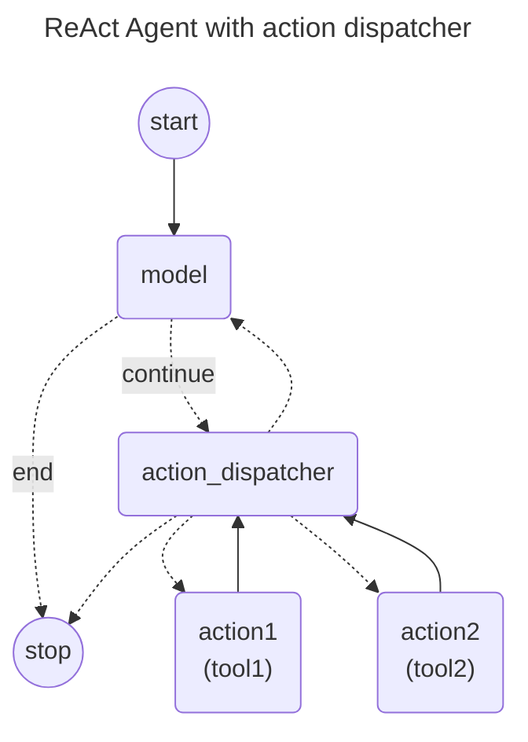
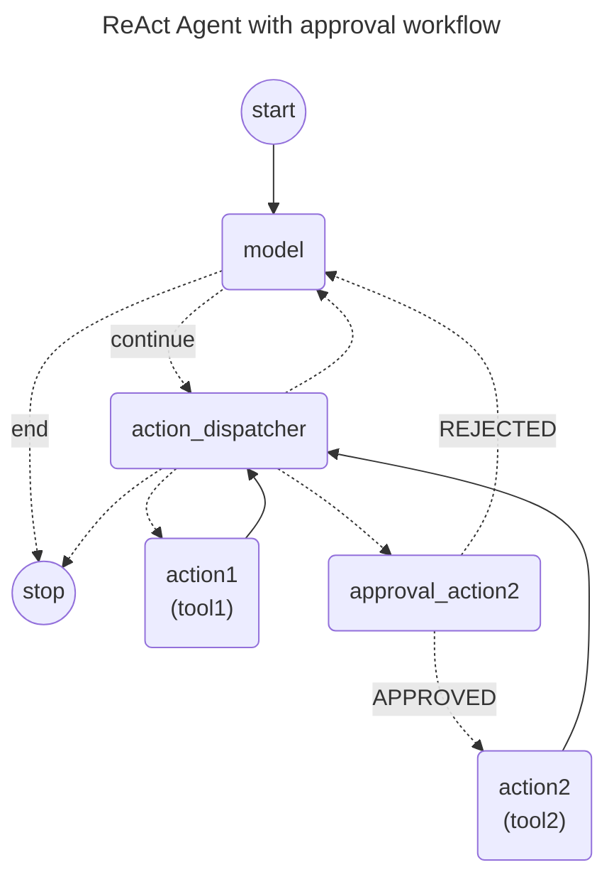

```mermaid
flowchart TD
	__START__((start))
	__END__((stop))
	agent("agent")
	action("actions
    (tools)")
	__START__:::__START__ --> agent:::agent
	agent:::agent -.->|continue| action:::action
	agent:::agent -.->|end| __END__:::__END__
	action:::action --> agent:::agent
```

```mermaid
---
title: ReAct Agent with action dispatcher
---
flowchart TD
	__START__((start))
	__END__((stop))
	model("model")
	action_dispatcher("action_dispatcher")
	threadCount("action1
    (tool1)")
	execTest("action2
    (tool2)")
	__START__:::__START__ --> model:::model
	model:::model -.->|continue| action_dispatcher:::action_dispatcher
	model:::model -.->|end| __END__:::__END__
	threadCount:::threadCount --> action_dispatcher:::action_dispatcher
	execTest:::execTest --> action_dispatcher:::action_dispatcher
	action_dispatcher:::action_dispatcher -.-> model:::model
	action_dispatcher:::action_dispatcher -.-> __END__:::__END__
	action_dispatcher:::action_dispatcher -.-> threadCount:::threadCount
	action_dispatcher:::action_dispatcher -.-> execTest:::execTest
```

```mermaid
---
title: ReAct Agent with approval workflow
---
flowchart TD
	__START__((start))
	__END__((stop))
	model("model")
	action_dispatcher("action_dispatcher")
	threadCount("action1
    (tool1)")
	approval_execTest("approval_action2")
	execTest("action2
    (tool2)")
	__START__:::__START__ --> model:::model
    action_dispatcher:::action_dispatcher
	model:::model -.->|continue| action_dispatcher:::action_dispatcher
	model:::model -.->|end| __END__:::__END__
	threadCount:::threadCount --> action_dispatcher:::action_dispatcher
	approval_execTest:::approval_execTest -.->|REJECTED| model:::model
    execTest:::execTest
	approval_execTest:::approval_execTest -.->|APPROVED| execTest:::execTest
	execTest:::execTest --> action_dispatcher:::action_dispatcher
	action_dispatcher:::action_dispatcher -.-> model:::model
	action_dispatcher:::action_dispatcher -.-> __END__:::__END__
	action_dispatcher:::action_dispatcher -.-> threadCount:::threadCount
	approval_execTest:::approval_execTest
	action_dispatcher:::action_dispatcher -.-> approval_execTest:::approval_execTest
```
