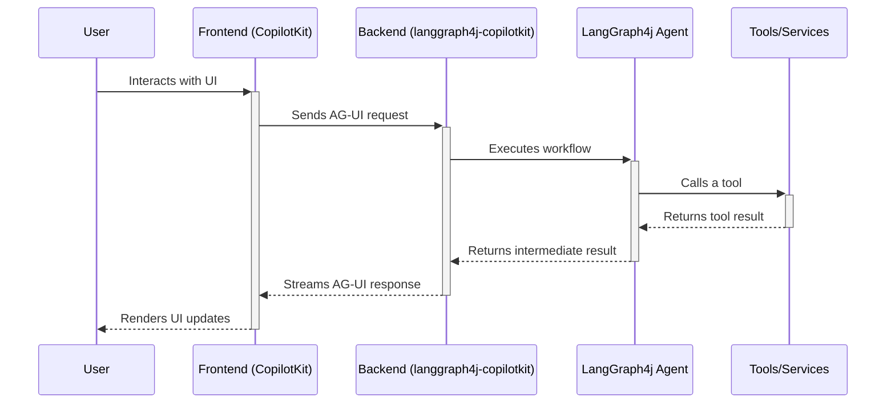
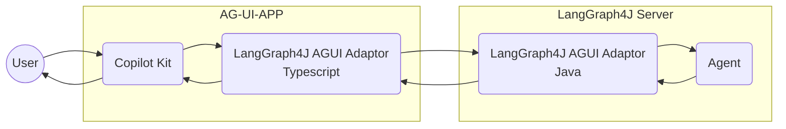

```mermaid
sequenceDiagram
    participant User
    participant Frontend (CopilotKit)
    participant Backend (langgraph4j-copilotkit)
    participant LangGraph4j Agent
    participant Tools/Services

    User->>+Frontend (CopilotKit): Interacts with UI
    Frontend (CopilotKit)->>+Backend (langgraph4j-copilotkit): Sends AG-UI request
    Backend (langgraph4j-copilotkit)->>+LangGraph4j Agent: Executes workflow
    LangGraph4j Agent->>+Tools/Services: Calls a tool
    Tools/Services-->>-LangGraph4j Agent: Returns tool result
    LangGraph4j Agent-->>-Backend (langgraph4j-copilotkit): Returns intermediate result
    Backend (langgraph4j-copilotkit)-->>-Frontend (CopilotKit): Streams AG-UI response
    Frontend (CopilotKit)-->>-User: Renders UI updates
```

```mermaid
flowchart LR
    User((User))
    CopilotKit(Copilot Kit)
    LangGraph4JAdaptor(LangGraph4J AGUI Adaptor
    Typescript)
    LangGraph4JServer(LangGraph4J AGUI Adaptor
    Java)
    Agent(Agent)
    subgraph "AG-UI-APP"
        CopilotKit --> LangGraph4JAdaptor
    end
    subgraph "LangGraph4J Server"
        LangGraph4JServer --> Agent
    end
    User --> CopilotKit
    %%CopilotKit --> LangGraph4JAdaptor
    LangGraph4JAdaptor --> LangGraph4JServer
    %%LangGraph4JServer --> Agent
    Agent --> LangGraph4JServer
    LangGraph4JServer --> LangGraph4JAdaptor
    LangGraph4JAdaptor --> CopilotKit
    CopilotKit --> User
    %% Legend
    %% - The User sends a request to the Copilot Kit.
    %% - The Copilot Kit processes the request and passes it to the LangGraph4J Adaptor.
    %% - The LangGraph4J Adaptor forwards the request to the LangGraph4J Server.
    %% - The LangGraph4J Server processes the request using the Agent.
    %% - The Agent processes the data and sends back a response to the LangGraph4J Server.
    %% - The LangGraph4J Server sends the processed response back to the LangGraph4J Adaptor.
    %% - The LangGraph4J Adaptor then sends the response back to the Copilot Kit.
    %% - Finally, the Copilot Kit presents the results back to the User.

```