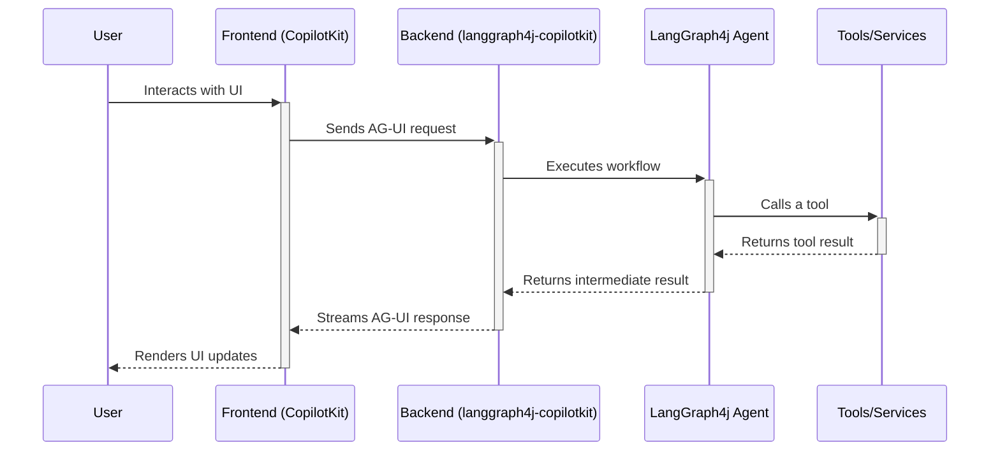

```mermaid
sequenceDiagram
    participant User
    participant Frontend (CopilotKit)
    participant Backend (langgraph4j-copilotkit)
    participant LangGraph4j Agent
    participant Tools/Services

    User->>+Frontend (CopilotKit): Interacts with UI
    Frontend (CopilotKit)->>+Backend (langgraph4j-copilotkit): Sends AG-UI request
    Backend (langgraph4j-copilotkit)->>+LangGraph4j Agent: Executes workflow
    LangGraph4j Agent->>+Tools/Services: Calls a tool
    Tools/Services-->>-LangGraph4j Agent: Returns tool result
    LangGraph4j Agent-->>-Backend (langgraph4j-copilotkit): Returns intermediate result
    Backend (langgraph4j-copilotkit)-->>-Frontend (CopilotKit): Streams AG-UI response
    Frontend (CopilotKit)-->>-User: Renders UI updates
```
